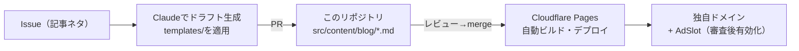

# blog — 構成ドキュメント（大枠）

自作ブログの scaffold。詳細は未決事項リストを順次つぶして詰める。
検討の経緯・比較は `blog-platform-plan.md`（プラットフォーム検討資料）を参照。

## 構成

**Astro 6 + Cloudflare Pages + 独自ドメイン + AdSense**



## ディレクトリ

```
blog/
├── astro.config.mjs        # site URL は独自ドメイン取得後に差し替え
├── src/
│   ├── content.config.ts   # 記事スキーマ（title/description/pubDate/tags/series/draft）
│   ├── content/blog/       # 記事本体（Markdown）。draft: true はビルド対象外
│   ├── layouts/BaseLayout.astro   # 共通レイアウト（AdSenseサイトタグはここに追加）
│   ├── components/AdSlot.astro    # 広告スロット。ADS_ENABLED=false で全体OFF
│   └── pages/
│       ├── index.astro     # 記事一覧
│       ├── blog/[...id].astro  # 記事ページ（上下にAdSlot配置済み）
│       ├── privacy.astro   # プライバシーポリシー（AdSense審査に必須・文面TODO）
│       ├── contact.astro   # 問い合わせ（方式TODO）
│       └── about.astro     # 運営者情報
├── public/ads.txt          # AdSense承認後に記入
├── templates/              # 記事テンプレ（zenn-blogから移植済み）
│   ├── article-template.md # frontmatterをAstro用に変更済み
│   ├── outline-agent.md    # koto-log編の見出し例
│   └── outline-rag.md      # biblio-rag編の見出し例
└── docs/
    ├── architecture.md     # このファイル
    └── writing-guide.md    # 執筆規約（シリーズ計画表を含む）
```

## パッケージマネージャ: pnpm（サプライチェーン対策）

npmではなくpnpmを採用。理由と設定（`pnpm-workspace.yaml`）:

- **ビルドスクリプトの既定ブロック**: 依存の install/postinstall スクリプトを実行しない（悪意あるパッケージの主要な攻撃経路を遮断）。必要な esbuild / sharp のみ `allowBuilds` で許可
- **minimumReleaseAge: 1440**: 公開から24時間未満のバージョンを入れない（ハイジャックされたリリースの検知猶予）
- pnpm 11 ではこれらがデフォルト。CI・Cloudflare Pages でも `pnpm-lock.yaml` があれば pnpm が自動選択される
- 追加運用: `pnpm audit` をCIに組み込む（textlint導入時に一緒に）

## 決定事項

| 項目                 | 決定                                                                                                                                                                                     |
| -------------------- | ---------------------------------------------------------------------------------------------------------------------------------------------------------------------------------------- |
| ドメイン             | **kinakomochio.dev**（仮。取得時に確定）                                                                                                                                                 |
| パッケージマネージャ | pnpm（下記セクション参照）                                                                                                                                                               |
| mermaid              | remarkプラグインで `<pre class="mermaid">` に変換 → クライアント側でSVG化。mermaidはnpmでバージョン固定・バンドル（CDN不使用＝サプライチェーン対策）。ブロックがあるページのみ動的import |
| コードハイライト     | Astro標準（Shiki）                                                                                                                                                                       |
| RSS                  | `@astrojs/rss`（`/rss.xml`）                                                                                                                                                             |
| CI                   | GitHub Actions で `pnpm build` チェック（`.github/workflows/ci.yml`）                                                                                                                    |
| Zenn連携             | **やらない**（本ブログに一本化。`zenn-blog/` の資産は移植済みで役目終了）                                                                                                                |
| 実装上の注意         | `.astro` のHTMLコメントは本番出力に残る。TODOはfrontmatter側にJSコメントで書く                                                                                                           |

## セットアップ手順（残り）

1. ✅ `pnpm install` → `pnpm build` 検証済み（lockfileコミット済み）
2. ✅ git リポジトリ化（初回コミット済み）
3. GitHubにリポジトリ作成 → push → Cloudflare Pages にリポジトリ接続（Framework preset: Astro）
4. kinakomochio.dev を取得（Cloudflare Registrar推奨）→ Pages にカスタムドメイン設定
5. privacy / contact / about の文面を埋める（各ファイルのfrontmatterにTODO記載）
6. 記事を10〜20本執筆（サンプル記事 `ai-arch-00-sample.md` は削除）
7. AdSense審査申請 → 通過後: BaseLayoutにサイトタグ・AdSlotのID設定・`ADS_ENABLED=true`・ads.txt記入

## 広告の設計

- `AdSlot.astro` に集約。`ADS_ENABLED` フラグ1つで全ページON/OFF（審査前・ポリシー違反時の即時停止用）
- 配置は記事ページの本文上・本文下の2箇所から開始。増やす場合もコンポーネント追加のみ
- 収益とUXのバランス調整は運用開始後にデータを見て決める

## 未決事項（残り）

| 項目            | 候補・メモ                                                                      |
| --------------- | ------------------------------------------------------------------------------- |
| デザイン/テーマ | 現状素のCSS最小限。自作 or Astroテーマ導入                                      |
| OG画像          | 自動生成（satori等）は後回しでよい                                              |
| アクセス解析    | Cloudflare Web Analytics（無料・Cookieレス）第一候補。Pages接続後にトークン取得 |
| 問い合わせ方式  | Google Forms 埋め込みが最小工数（推奨）                                         |
| textlint        | 執筆自動化フェーズ2でCIに追加（pnpm audit・gitleaksは導入済み）                 |

ドラフト生成スキルは `skills/write-draft/SKILL.md` に作成済み。`.claude/skills/` へ移すとClaude Code / Coworkが自動参照する（`git mv skills .claude/skills`）。
