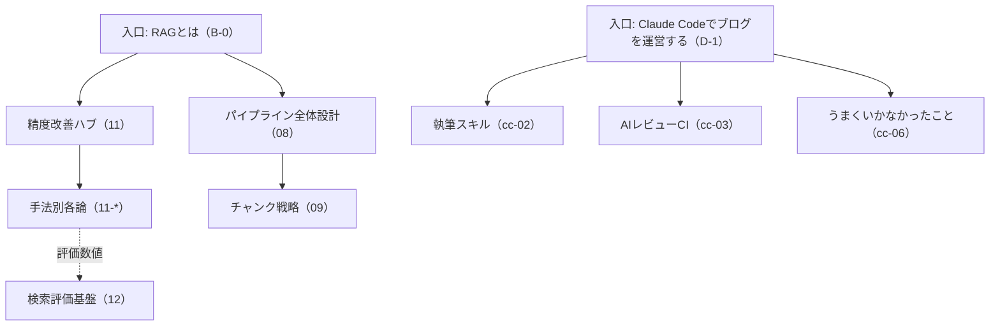

# ブログ戦略 2026年7月改訂 — 方向性の見直し

基本方針は従来どおり:「**自分が作ったプロダクトを通して、AI開発の理解を深める記事を書く**」。
この改訂では、国内外の人気ブログの成功パターンを取り込み、記事群を **2本柱** に再編成する。

## 2本柱

| 柱  | 内容                                                                 | 題材                                   | シリーズ                                    |
| --- | -------------------------------------------------------------------- | -------------------------------------- | ------------------------------------------- |
| 1   | **RAG** — RAGとは何か、RAGの機能とその実際の作り                     | biblio-rag                             | `ai-architecture`（既存B系） + 入口ハブ記事 |
| 2   | **Claude Code開発の実態と工夫** — AIエージェントと開発する現場の記録 | このブログ自体 / koto-log / biblio-rag | `claude-code`（新設D系）                    |

koto-logのエージェント編（A系）は柱1・2の素材として引き続き活用する（エージェントループはRAGチャットの土台であり、Claude Code活用の題材でもある）。既存記事・slugの変更はしない。

## 参考にした人気ブログと抽出パターン

### 海外

| ブログ                             | 強み                                                                                                        | 本ブログへの適用                        |
| ---------------------------------- | ----------------------------------------------------------------------------------------------------------- | --------------------------------------- |
| Simon Willison (simonwillison.net) | 高頻度の一次体験レポート。小さな学び（TIL）と長文まとめの2層構成                                            | 軽量記事枠の新設（→執筆規約）           |
| Eugene Yan (eugeneyan.com)         | 「Patterns for LLM Systems」型のパターンカタログ。網羅+実装参照                                             | B-4をハブ化し、手法別記事から相互リンク |
| Hamel Husain (hamel.dev)           | evals中心の改善プレイブック。「計測なしに改善なし」                                                         | B-5 / A-7（評価系）を柱1の中核に格上げ  |
| Armin Ronacher (lucumr.pocoo.org)  | Claude Code実録の第一人者。「Things That Didn't Work」（失敗談）と「A Year of Vibes」（定点観測）が特に人気 | D-6失敗談記事・D-1定点観測記事の新設    |

### 国内

| ブログ/記事                                 | 強み                                                           | 本ブログへの適用                 |
| ------------------------------------------- | -------------------------------------------------------------- | -------------------------------- |
| Zenn「Claude Code」トピックの上位記事群     | 「◯年◯月現在の開発フロー」型スナップショット記事が強い         | D-1を定期更新型に                |
| Qiita/Zennの執筆環境構築記録系              | 「問題→スキル化→スクリプト化」の仕組み化サイクルを見せる形式   | D-2（write-draftスキル）の記事化 |
| Zenn「RAGをゼロから実装して仕組みを学ぶ」等 | 「〜とは + 図解 + 動くコード」の入門記事が検索流入の入口になる | B-0（RAGとは）ハブ記事の新設     |
| Zenn「RAGの教科書」型の網羅記事             | ハブ記事から各論へ誘導する内部リンク構造                       | ハブ&スポーク導線（下記）        |

### 抽出した共通成功パターン

1. **ハブ&スポーク構造** — 検索意図の広い「〜とは」入口記事を置き、そこから自作プロダクトの実装各論へ内部リンクで誘導する。各論記事からもハブへ戻す。
2. **失敗談の透明性** — うまくいったことだけでなく「試したが捨てたこと」を書く。実体験の証明になり、AI生成記事との最大の差別化になる（既存の「採用しなかった案と理由」規約と同じ思想の拡張）。
3. **定点観測** — 「2026年◯月現在」と時点を明記したワークフロー記事を半年ごとに出し直す。陳腐化を弱点でなく更新ネタに変える。
4. **評価(Evals)ファースト** — 改善記事は必ずBefore/Afterの数値を示す（hit@k / MRR / ツール選択正答率）。海外人気ブログはほぼ例外なくここを核にしている。
5. **高頻度のための軽量枠** — 大作主義は更新停止のもと。TIL的な短い記事を許容し、継続発信で検索評価と読者定着を得る。

## ハブ&スポーク導線（内部リンク設計）

- 入口記事（B-0 / D-1）は検索キーワードを広く取り、各論は「設計判断が見えるタイトル」で深く取る（既存規約どおり）
- 各論記事の「はじめに」と「まとめ」に入口記事へのリンクを必ず置く

## 優先順位（今後の執筆順）

1. **B-0「RAGとは」入口ハブ記事** — 柱1の検索導線を最初に確保する
2. **D-1「Claude Codeでブログを自動運営する」定点観測記事** — 柱2の入口。素材はこのリポジトリで完結し、すぐ書ける
3. 既存シリーズ計画の続き（ai-arch-04以降）を、RAG編（08以降）優先に組み替えて進める
4. D-2 / D-3（スキル・AIレビューCI）— D-1から分岐する各論
5. D-6「うまくいかなかったこと」— 素材が3件以上たまった時点で

## 変えないこと

- 実体験・実測値・失敗談を核にする（AI生成色の排除）
- コード引用はSHA付きパーマリンク・実物照合
- 1記事1テーマ、設計判断が見えるタイトル
- draft → 人間レビュー → 公開のフロー
