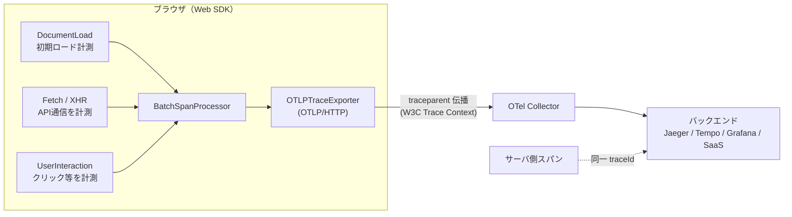

# ブラウザ向け OpenTelemetry 導入検討

参照: [OpenTelemetry でブラウザのフロントエンドを計装する（Cybozu Frontend）](https://zenn.dev/cybozu_frontend/articles/opentelemetry-browser-frontend)

「フロントエンドの実挙動（初期ロード・API通信・ユーザー操作）を分散トレースで観測したい」という動機で、ブラウザ向け OpenTelemetry（以下 OTel）の導入可否を検討する。結論を先に置く: **このブログには入れない。導入価値があるのは biblio-rag（チャットUI）であり、そこでの PoC と記事化を推奨する。**

## 背景 — なぜ検討するか

- 参照記事は「実プロダクトのフロントエンド」を計装し、ブラウザで発生したスパンを OTel Collector 経由でバックエンドに送り、サーバ側スパンと**1本のトレースに連結**する構成を扱っている。
- 本ブログ・自作プロダクト群でも「フロント→API→RAG/LLM」の一連の遅延を1トレースで追えると、体感速度の劣化箇所を特定できる。特に biblio-rag は SSE ストリーミングチャット（B-6）と非同期アップロードUX（B-11）を持ち、フロント計装の余地が大きい。
- 一方で本ブログは**静的Astro配信 + Cloudflare Web Analytics 決定済み**で、受け皿の Collector もない。「導入対象を取り違えると重いだけ」になるため、対象選定を含めて検討する。

## ブラウザ OTel の標準構成（参照記事の要点）



### 中核パッケージ

| 役割             | パッケージ                                                                 | 補足                                                                                                                                                 |
| ---------------- | -------------------------------------------------------------------------- | ---------------------------------------------------------------------------------------------------------------------------------------------------- |
| Provider         | `@opentelemetry/sdk-trace-web`（`WebTracerProvider`）                      | ブラウザ用のトレーサプロバイダ                                                                                                                       |
| 非同期の文脈伝播 | `@opentelemetry/context-zone`（`ZoneContextManager`）                      | Promise/イベント跨ぎで span 親子を維持                                                                                                               |
| 計装登録         | `@opentelemetry/instrumentation`（`registerInstrumentations`）             | 自動計装をまとめて有効化                                                                                                                             |
| 自動計装         | `@opentelemetry/auto-instrumentations-web`（`getWebAutoInstrumentations`） | 個別に入れるなら `instrumentation-document-load` / `instrumentation-fetch` / `instrumentation-xml-http-request` / `instrumentation-user-interaction` |
| エクスポート     | `@opentelemetry/exporter-trace-otlp-http`（`OTLPTraceExporter`）           | OTLP/HTTP。`BatchSpanProcessor` と組み合わせ                                                                                                         |
| リソース属性     | `@opentelemetry/resources` + semantic-conventions                          | `service.name` 等でサービスを識別                                                                                                                    |

### 実装イメージ（骨子）

```ts
const provider = new WebTracerProvider({
  resource: resourceFromAttributes({ [ATTR_SERVICE_NAME]: "biblio-rag-web" }),
  spanProcessors: [
    new BatchSpanProcessor(
      new OTLPTraceExporter({ url: "https://collector.example/v1/traces" }),
    ),
  ],
});
provider.register({ contextManager: new ZoneContextManager() });

registerInstrumentations({
  instrumentations: getWebAutoInstrumentations({
    "@opentelemetry/instrumentation-fetch": {
      // サーバ側スパンと連結するため traceparent を許可オリジンに付与
      propagateTraceHeaderCorsUrls: [/https:\/\/api\.example\//],
    },
  }),
});
```

### 分散トレース連結の肝

- フロントの `fetch`/XHR に `traceparent` ヘッダを乗せ、サーバ側 OTel が同じ traceId で子スパンを作ることで1本につながる。
- そのためには **(1)** `propagateTraceHeaderCorsUrls` で対象オリジンを明示し、**(2)** サーバ側の CORS で `traceparent` を許可（`Access-Control-Allow-Headers`）する必要がある。ここが未設定だと「フロントとサーバが別トレースに割れる」典型の落とし穴。

## 導入対象の適合性評価

| 対象           | ブラウザフロントの有無                    | 計装で得られるもの                                        | 受け皿(Collector/BE)           | 判定                             |
| -------------- | ----------------------------------------- | --------------------------------------------------------- | ------------------------------ | -------------------------------- |
| **このブログ** | ほぼ静的（JSはmermaid動的importのみ）     | 初期ロード指標程度。API通信・操作の観測対象が乏しい       | 無し。用意すると常設運用コスト | ✕ 過剰                           |
| **koto-log**   | 無し（LINE bot / サーバ中心）             | フロント計装の対象そのものが無い                          | —                              | ✕ 対象外（サーバ側OTelは別議論） |
| **biblio-rag** | 有り（SSEチャットUI・非同期アップロード） | フロント→API→RAG/LLM の分散トレース。体感遅延の内訳可視化 | 要検討（下記）                 | ◎ PoC候補                        |

- このブログの計測ニーズは **Cloudflare Web Analytics（Cookieレス・無料、決定済み）** でほぼ満たされる。ブラウザOTelはバンドル増と Collector 常設運用に見合わない。
- koto-log は**ブラウザフロントを持たない**ため、そもそもブラウザOTelの対象外。サーバ側の計装は A-6（LLM可観測性）の文脈で別途扱う。
- biblio-rag は SSE ストリーミング（B-6）とアップロードUX（B-11）があり、フロントの遅延内訳を追う価値がある。既存構想の **A-6「全LLM呼び出しの唯一の通り道で計測」** とサーバ側スパンで連結すれば、「入力→フロント→API→RAG検索→LLM生成」を1トレースで俯瞰できる。

## コスト・注意点

- **バンドルサイズ**: Web SDK + 自動計装群は数十KB規模。遅延読み込み（動的import）や本番/開発での有効化切替を前提にする。
- **受け皿の運用**: OTLP を受ける Collector とバックエンド（Jaeger/Tempo/Grafana、または Grafana Cloud / Honeycomb 等の無料枠）が必要。biblio-rag の **「アイドル課金ゼロ」方針（B-9）と衝突する**ため、常設 Collector ではなく「①ローカル/開発時のみ有効化」「②SaaS無料枠に直送」のいずれかを前提にする。
- **CORS**: `traceparent` を跨オリジンで送るため、サーバ側 CORS 許可が必須（前述）。
- **PII・サンプリング**: URL・クエリ・入力本文に個人情報が混じりうる。A-6と同じ **「本文をイベントに含めない」PII方針**を踏襲し、属性をallowlist化。トラフィックに応じたサンプリング（親ベース）も設定。
- **取りこぼし**: ページ離脱時のスパンは `BatchSpanProcessor` のフラッシュ前に失われうる。`visibilitychange`/`pagehide` でのフラッシュ、または `sendBeacon` ベースの送出を検討。
- **best-effort**: 計測失敗が本処理を止めない（A-6と同じ思想）。初期化・送出の例外は握りつぶしてログのみ。

## 採否判断

| 項目               | 判断                                                                                                                                       |
| ------------------ | ------------------------------------------------------------------------------------------------------------------------------------------ |
| このブログへの導入 | **採用しない**。Cloudflare Web Analytics で足り、Collector 常設コストに見合わない                                                          |
| koto-log           | **対象外**（ブラウザフロント無し）                                                                                                         |
| biblio-rag         | **PoC を推奨**。SSEチャットUI→API→RAG/LLM の分散トレースを、開発時 or SaaS無料枠直送で試す。常設 Collector は B-9 方針と衝突するため避ける |
| 記事化             | **有効**。「ブラウザ計装」は入門需要があり、biblio-rag の実物で「動くコード＋図解」型にできる（下記）                                      |

## biblio-rag PoC の段階案（採用時）

1. **ローカルで最小構成**: `WebTracerProvider` + `DocumentLoad`/`Fetch` 自動計装 → ローカル Collector（docker）→ Jaeger UI でトレース表示を確認。
2. **サーバ連結**: `propagateTraceHeaderCorsUrls` とサーバ CORS を設定し、フロント⇄APIが1トレースに連結することを確認。A-6のサーバ計装と traceId を突き合わせる。
3. **PII/サンプリング**: 属性 allowlist・本文除外・サンプリングを入れる。
4. **送出先の恒久化判断**: 開発時のみ有効化か、SaaS無料枠直送か（B-9=アイドル課金ゼロと整合する方）を決める。常設 Collector は原則採らない。

## 記事化の観点（article-ideas との接続）

- 単発の技術ネタとして成立する。「〜とは＋図解＋動くコード」の入口記事パターン（blog-strategy の成功パターン）に乗せやすい。
- 位置づけ候補: **F系（ブログ自体編）ではなく、biblio-rag の実装各論として B系寄り**、または E（未実装バックログ）に「ブラウザOTelでフロント→RAGを分散トレース」を追加。A-6（LLM可観測性）とハブ&スポークで相互リンクできる。
- 記事化する場合の差別化: 「フロントとサーバがトレース分断する落とし穴（CORS/traceparent）」と「アイドル課金ゼロと両立させる送出先設計」という、一般入門記事に無い実体験を核にする。

## 参考リンク

- [ブラウザ | OpenTelemetry（公式・日本語）](https://opentelemetry.io/ja/docs/languages/js/getting-started/browser/)
- [計装 | OpenTelemetry（公式・日本語）](https://opentelemetry.io/ja/docs/languages/js/instrumentation/)
- [OpenTelemetry でフロントエンドのトレースを取得する（Zenn / lapi）](https://zenn.dev/lapi/articles/2025-07-20-otel-frontend)
- [OpenTelemetry Browser Instrumentation for Frontend Observability（OneUptime）](https://oneuptime.com/blog/post/2026-01-07-opentelemetry-browser-frontend/view)
