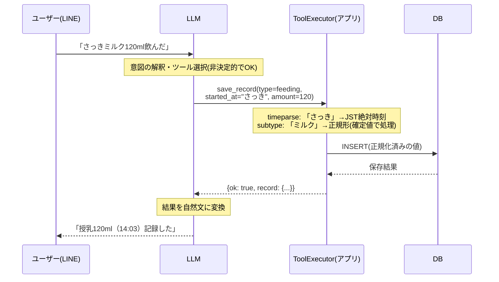

## はじめに

LLMを組み込んだアプリを作り始めると、最初にぶつかるのが「どこまでLLMに任せるか」という線引きです。何でもできるように見えるので全部任せたくなりますが、それをやると数字が合わない・時刻がずれる・集計カテゴリが割れる、といった「たまに間違うシステム」ができあがります。

この記事は、AIを組み込んだ個人開発アプリのアーキテクチャを解説するシリーズの第1回です。

**この記事で分かること**

- LLMとアプリコードの責務を分ける具体的な基準
- 「LLMが苦手な処理」をアプリ側で確定値に変える実装パターン
- 全部LLMに任せる案・全部ルールベースの案と比べたときのトレードオフ

**対象読者**: LLMアプリ（特にTool Use / Function Calling）を作り始めたが、LLMとアプリコードの役割分担に迷っている人

## 題材アプリ

[koto-log](https://github.com/Kaaaaazuya/koto-log) — LINEで動く育児記録エージェントです。「3時にミルク120ml飲んだ」と送ると構造化して保存し、「今日何回飲んだ？」と聞くと集計して返します。中核はLLMのTool Use：入力に応じてLLMが「どのツールを・どの引数で呼ぶか」を判断し、アプリ側のコードがDBを更新・参照します。

本記事のコードはすべて[コミット `20845c0` 時点](https://github.com/Kaaaaazuya/koto-log/tree/20845c04ee5716d323525ed765c61fc0bb1be34a)のものです。

## 課題: LLMに任せすぎると何が起きるか

育児記録アプリでLLMに「全部」任せると、次の問題が起きます。

まず**時刻計算**。「さっき飲んだ」の「さっき」を何時何分にするかをLLMに計算させると、現在時刻の認識ズレやタイムゾーンの取り違えで記録がずれます。育児記録では「前回の授乳から何時間空いたか」が重要な情報なので、時刻のズレは致命的です。

次に**表記ゆれ**。「母乳」「おっぱい」「直母」を別カテゴリとして保存してしまうと、「母乳は今日何回？」という集計が割れます。LLMに「正規化して」と指示しても、毎回同じ正規形に寄せてくれる保証はありません。

そして**計算**。「今日の合計量は？」に対してLLMが記録を読んで自分で足し算をすると、たまに間違えます。LLMは確率的なテキスト生成器であって電卓ではないためです。

共通するのは、どれも**決定的に解ける処理**だということです。決定的に解けるものをわざわざ非決定的なコンポーネントにやらせる理由はありません。

## 全体像: LLM担当とアプリ担当の境界線

koto-logの設計の核心は「LLMに決めさせる範囲を最小化する」ことです。LLMは**意図の解釈・ツール選択・文章生成**だけを担い、**計算・DB操作・時刻解決・正規化**はアプリコードが確定値で行います。



ポイントは、LLMがツールに渡す `started_at="さっき"` を**そのまま**受け取り、変換はアプリ側で行うことです。責務の分担を表にするとこうなります。

| 処理 | 担当 | 理由 |
|---|---|---|
| 「うんち」→ `diaper` と判断する | LLM | 自然言語の解釈 |
| どのツール（save/query/update）を呼ぶか | LLM | 意図の分類 |
| 「さっき」→ JST絶対時刻に変換する | アプリ | 決定的に解ける時刻計算 |
| 「粉ミルク」→「ミルク」に正規化する | アプリ | 集計ブレの防止 |
| DBにINSERT/SELECTする | アプリ | LLMはSQLを書かない |
| 件数・合計量・経過時間を計算する | アプリ | LLMは数え直さない |
| 計算結果を自然な文章にする | LLM | 文章生成 |
| 情報不足なら聞き返す | LLM | 対話の制御 |

判断基準はシンプルで、**「その処理は決定的に解けるか？」**です。解けるならアプリコード、解けない（自然言語の解釈が必要な）ものだけLLM、と割り切ります。

## 実装

### 1. 「さっき」はLLMに変換させない — timeparse.py

まずシステムプロンプト側で、LLMに時刻変換を**させない**ことを明示します。

```text
# src/kotolog/agent/loop.py の SYSTEM_PROMPT より抜粋
ルール:
- 記録・集計・修正/取り消しは必ずツールを呼ぶ
- 時刻はユーザーが言ったまま（「さっき」「3時」等）ツールに渡す。自分で変換しない
```

「〜せよ」ではなく「〜するな（そのまま渡せ）」と指示するのがミソです。変換はアプリ側の `normalize()` が確定値で行います。

```python
# src/kotolog/utils/timeparse.py（抜粋）
def normalize(text: str | None, now: datetime | None = None) -> str:
    """相対/絶対の時刻表現を JST 絶対時刻の ISO8601 文字列にする。"""
    now = _to_jst(now) if now else datetime.now(JST)

    if not text or not text.strip():
        return now.isoformat()
    s = text.strip()

    # 「今/さっき」系
    if s in _NOW_WORDS:
        return now.isoformat()

    # 「N分前 / N時間前」
    m = _AGO_RE.search(s)
    if m:
        n = int(m.group(1))
        delta = timedelta(minutes=n) if m.group(2) == "分" else timedelta(hours=n)
        return (now - delta).isoformat()

    # 「HH時(MM分)」→ 直近の過去のその時刻
    m = _HM_RE.search(s)
    if m:
        hour = int(m.group(1))
        minute = int(m.group(2)) if m.group(2) else 0
        candidate = now.replace(hour=hour % 24, minute=minute, second=0, microsecond=0)
        if candidate > now:
            candidate -= timedelta(days=1)
        return candidate.isoformat()
    # ...(略: 名前付き時間帯、認識不能ならnow)
```

[全文はこちら](https://github.com/Kaaaaazuya/koto-log/blob/20845c04ee5716d323525ed765c61fc0bb1be34a/src/kotolog/utils/timeparse.py)。正規表現ベースの地味なコードですが、**同じ入力には必ず同じ結果を返し、テストが書ける**のが価値です。「3時」を「直近の過去の3時」に倒す仕様（未来の記録は存在しないため）のような業務ルールも、プロンプトではなくコードに置くことで確実に効きます。認識できない入力は安全側に倒して現在時刻を返します。

### 2. 表記ゆれは辞書で正規化する — subtype.py

「母乳/おっぱい/直母」のような表記ゆれは、保存前に同義語辞書で正規形へ寄せます。

```python
# src/kotolog/utils/subtype.py（抜粋）
_SYNONYMS: dict[str, dict[str, tuple[str, ...]]] = {
    RecordType.FEEDING: {
        FeedingSubType.BREAST: ("母乳", "おっぱい", "直母"),
        FeedingSubType.FORMULA: ("ミルク", "粉ミルク", "人工乳"),
        FeedingSubType.PUMPED: ("搾母乳", "搾乳", "さく乳"),
    },
    # ...(略)
}

def normalize_sub_type(type: str | None, sub_type: str | None) -> str | None:
    """`type` の文脈で sub_type を正規形へ寄せる。未知値はそのまま返す。"""
    if sub_type is None:
        return None
    value = sub_type.strip()
    if not value:
        return None
    table = _REVERSE.get(type or "")
    if table:
        canon = table.get(value.lower())
        if canon:
            return canon
    return value
```

これもLLMに「ミルクに統一して」と頼めばだいたいやってくれますが、「だいたい」では集計が割れます。一方で、**辞書に無い値はそのまま通す**のもポイントです。自由入力の表現力（LLMアプリの強み）を殺さずに、集計に効く主要カテゴリだけを確実に揃えます。

### 3. 計算とSQLはExecutorが確定値で行う — executor.py

LLMが選んだツール呼び出しは `ToolExecutor` が受け取り、正規化→DB操作→集計をすべてコードで行います。

```python
# src/kotolog/tools/executor.py（抜粋）
def _save_record(self, args: dict) -> dict:
    # LLMから来た「さっき」「粉ミルク」をここで確定値に変換する
    started_at = normalize(args["started_at"], now=self.now)
    sub_type = normalize_sub_type(args["type"], args.get("sub_type"))
    rid = crud.insert_record(
        self.conn,
        child_id=self.child_id,
        type=args["type"],
        sub_type=sub_type,
        amount=args.get("amount"),
        started_at=started_at,
        # ...(略)
    )
    return {"ok": True, "action": "save", "record": _record_to_dict(...)}

def _query_records(self, args: dict) -> dict:
    start, end = self._resolve_period(args["period"], ...)
    rows = crud.query_records(self.conn, child_id=self.child_id,
                              start=start, end=end, type=args.get("type"), ...)
    # 合計・件数・カテゴリ別集計はすべてPythonで計算する
    total = sum(r["amount"] for r in rows if r["amount"] is not None)
    return {"ok": True, "count": len(rows), "total_amount": total,
            "by_type": _aggregate(rows, "type"), ...}
```

集計結果（`count` や `total_amount`）は**計算済みの値**としてLLMに返します。システムプロンプト側でも「返ってくる値をそのまま使う」「数え直さない」ことを指示しており、LLMの仕事は確定値を自然な日本語にするところだけです。

## 設計判断とトレードオフ

| 案 | 採否 | 理由 |
|---|---|---|
| LLMに解釈もツール選択も計算も全部任せる | ❌ | 時刻・計算・正規化が非決定的になり「たまに間違うシステム」になる。デバッグもテストも困難 |
| 全部ルールベース（LLMを使わない） | ❌ | 「9時に母乳、10時から昼寝」のような自由な複文をパーサで受けるのは非現実的。自由入力こそがこのアプリの価値 |
| LLMは解釈のみ、確定処理はコード（採用） | ✅ | 非決定性を「意図の解釈」に閉じ込め、記録される値は常に決定的。テスト可能な範囲が最大化される |

採用案には副次的なメリットが2つあります。

**小型モデルでも成立する**: LLMの仕事が「ツールを選んで引数を埋める」だけまで削られているので、ローカルの小型モデルでも実用になります。実際koto-logはローカルOllamaで完全無料で動き、モデル文字列の変更だけでClaudeに切り替えられます（この抽象化はシリーズ第5回で扱います）。

**テストとevalsを分離できる**: 決定的な部分（timeparse・subtype・executor）は普通のpytestで網羅し、非決定的な部分（ツール選択）だけを別立てのevalsで正答率計測します（第7回で扱います）。

一方でトレードオフもあります。時刻表現や同義語の**カバレッジはコードを書いた分だけ**しか広がりません。「一昨日の夜」のような未対応表現は現在時刻に倒れます。ここはLLMに任せれば「それっぽく」動く領域なので、正確性のために柔軟性を捨てる選択をしたことになります。運用しながら辞書とパターンを足していく前提の設計です。

## まとめ

- LLMとアプリの線引き基準は「その処理は決定的に解けるか」。解けるならコード、解けないならLLM
- プロンプトには「変換するな、そのまま渡せ」と書き、変換・計算・正規化はアプリ側で確定値にする
- 非決定性を意図の解釈に閉じ込めると、テスト可能性・小型モデル対応・デバッグ容易性がまとめて手に入る

次回は、この設計を動かしているエージェントループ本体（入力→LLM→ツール実行→結果戻し→…の反復）を238行のコードで解説します。

## 参考

- [koto-log リポジトリ](https://github.com/Kaaaaazuya/koto-log)（本記事はコミット `20845c0` 時点のコードに基づく）
- [Anthropic — Tool use ドキュメント](https://docs.claude.com/en/docs/build-with-claude/tool-use/overview)
