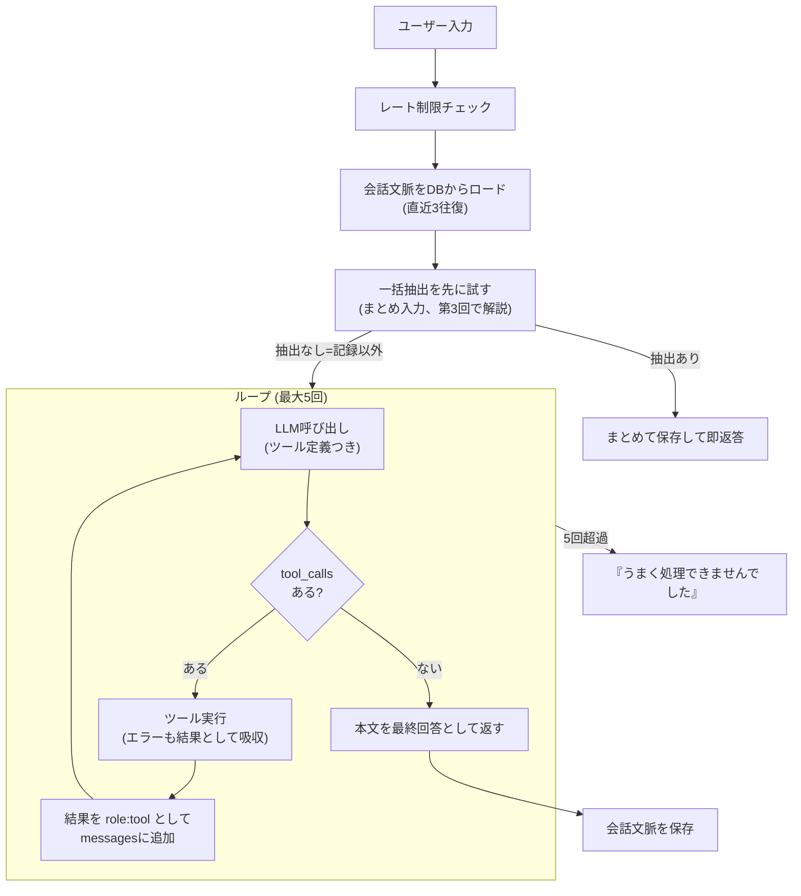

## はじめに

[前回](/blog/ai-arch-01-llm-responsibility/)は、LLMとアプリコードの責務分離を扱いました。今回はその設計を実際に動かしている**エージェントループ**——「入力 → LLM → ツール実行 → 結果を戻す → …」の反復——を解説します。

LangChainやAgents SDKのようなフレームワークを使えばループは隠蔽されますが、koto-logでは**自前の238行**で実装しています。中身を一度自分で書いておくと、フレームワークが何をやっているか・どこで壊れるかが分かるようになります。

**この記事で分かること**

- エージェントループの最小構成（メッセージ履歴・ツール実行・反復の止め方）
- ツール実行エラーを「ループの外に漏らさない」エラーハンドリング
- ステートレスなWebhookサーバーで会話文脈を保つ方法

**対象読者**: Tool Use / Function Callingの1往復はできたが、複数ターンのエージェントにする方法を知りたい人

## 題材アプリ

[koto-log](https://github.com/Kaaaaazuya/koto-log) — LINEで動く育児記録エージェント（詳細は[第1回](/blog/ai-arch-01-llm-responsibility/)参照）。本記事のコードは[コミット `20845c0` 時点](https://github.com/Kaaaaazuya/koto-log/tree/20845c04ee5716d323525ed765c61fc0bb1be34a)の [`src/kotolog/agent/loop.py`](https://github.com/Kaaaaazuya/koto-log/blob/20845c04ee5716d323525ed765c61fc0bb1be34a/src/kotolog/agent/loop.py)（238行）です。

## 課題: Tool Useの「1往復」では会話が成立しない

Tool Useの基本形は「LLMがツールを選ぶ → アプリが実行する」の1往復です。しかし実際の会話はこれで終わりません。

「今日は何回飲んだ？」の場合、①LLMが `query_records` を選ぶ → ②アプリがDBを集計する、という流れがあります。③**その結果をもう一度LLMに渡して**「今日は5回、合計600ml飲んだ」という文章にしてもらうところまで必要です。ツールの実行結果を見てLLMが次の行動（別のツールを呼ぶ・文章を返す・聞き返す）を決める——この反復がエージェントループです。

反復には終わり方の設計も要ります。LLMがツールを呼び続けて止まらないケース、逆にツール結果を待たずに幻覚で答えてしまうケースの両方を防ぐ必要があります。

## 全体像



ループの終了条件は2つだけです。**LLMがツールを呼ばなくなったら**その本文を最終回答とする（正常系）、**5回繰り返しても終わらなければ**諦めて謝る（異常系）。

## 実装

### 1. ループ本体 — 30行で書ける

```python
# src/kotolog/agent/loop.py（handle() 内・抜粋）
messages: list[dict] = [{"role": "system", "content": self.system_prompt}]
if history:
    messages.extend(history)
messages.append({"role": "user", "content": user_text})

for _ in range(self.max_iters):  # MAX_ITERS = 5
    resp = self.client.complete(messages, tools=TOOLS, operation="loop")
    message = resp.choices[0].message
    calls = _extract_calls(message)

    if not calls:
        # ツールを呼ばなかった = 最終回答（または聞き返し）
        reply = message.content or ""
        if line_user_id:
            self._save_session_context(line_user_id, history, user_text, reply)
        return reply

    messages.append(self._assistant_message(message, calls))
    for call in calls:
        result = self._run_tool(call, executor)
        messages.append({
            "role": "tool",
            "tool_call_id": call.id,
            "content": json.dumps(result, ensure_ascii=False, default=str),
        })

# 5回で終わらなければ諦める
reply = "すみません、うまく処理できませんでした。もう一度お願いします。"
```

構造は単純で、`messages` に「assistantのツール呼び出し」と「その実行結果（`role: "tool"`）」をペアで積んでは、LLMをもう一度呼ぶだけです。LLMは積み上がった履歴全体を見て、次のツールを呼ぶか、最終回答を書くかを自分で決めます。

「聞き返し」が特別扱い不要なのもこの構造の利点です。情報が足りないときLLMはツールを呼ばずに「何時のことですか？」と本文で返すので、正常終了と同じ経路で自然に処理されます。

### 2. ツール実行のエラーをループの外に漏らさない

LLMは存在しないツール名や不正な引数を渡してくることがあります。そこで例外を投げてループごと落とすのではなく、**エラーを「実行結果」としてLLMに返します**。

```python
# src/kotolog/agent/loop.py
def _run_tool(self, call: _Call, executor: ToolExecutor) -> dict:
    # 未知ツールや不正引数でループを落とさず、結果としてLLMに戻す
    try:
        return executor.execute(call.name, call.args)
    except Exception as e:
        return {"ok": False, "error": f"{type(e).__name__}: {e}"}
```

エラーを受け取ったLLMは、引数を直して再試行するか、ユーザーに聞き返すかを次のイテレーションで判断できます。「LLM由来の不正入力は例外ではなく通常の入力」として扱うのが、エージェントのエラーハンドリングの基本方針です。

### 3. ステートレスなWebhookで会話文脈を保つ

LINEのWebhookはリクエストごとに独立しているため、「聞き返し → 返答」をまたぐ文脈はDBに永続化します。ポイントは**無制限に貯めない**ことです。

```python
# src/kotolog/agent/loop.py
MAX_CONTEXT_TURNS = 3  # 保持する往復数

def _save_session_context(self, line_user_id, prior_history, user_text, reply_text):
    """今回の往復を会話文脈に追加し、直近 MAX_CONTEXT_TURNS 往復分に切り詰めて保存する。"""
    context = (prior_history or []) + [
        {"role": "user", "content": user_text},
        {"role": "assistant", "content": reply_text},
    ]
    crud.set_session_context(self.conn, line_user_id, context[-(MAX_CONTEXT_TURNS * 2):])
```

履歴が長いほど入力トークン（=コストとレイテンシ）が増え、古い文脈が新しい指示を汚染するリスクも上がります。育児記録の対話は「直前の聞き返しに答える」程度の文脈で十分なので、3往復で切り捨てます。保存するのは**ツール呼び出しを除いた最終的なuser/assistantのやり取りだけ**で、ループ途中のtoolメッセージは持ち越しません。

なお `handle()` の冒頭ではユーザーごとのLLM呼び出しレート制限もチェックしており、暴走や悪意ある連投でAPI課金が膨らむのを防いでいます。

## 設計判断とトレードオフ

| 案                                              | 採否 | 理由                                                                                                             |
| ----------------------------------------------- | ---- | ---------------------------------------------------------------------------------------------------------------- |
| エージェントフレームワーク（LangChain等）を使う | ❌   | ループ自体は30行で書ける規模。抽象化の学習コストとブラックボックス化のほうが高くつく。仕組みを学ぶ目的にも反する |
| 自前ループ + 上限5回（採用）                    | ✅   | 制御・観測・テストのすべてが自分のコードで完結する。LLM呼び出し回数の上限が明示的                                |
| 上限なしでLLMに任せる                           | ❌   | ツール呼び出しが収束しない場合にコストが青天井になる。失敗を「謝って再入力を促す」に倒すほうが安全               |

MAX_ITERS=5という値は「保存＋集計＋修正のような複合依頼でも3〜4回で収束する」という実測からの余裕込みの設定です。上限到達は実質バグのシグナルなので、静かにリトライせずユーザーに再入力を促します。

トレードオフとして、フレームワークが提供する並列ツール実行・ストリーミング・リトライ戦略などは自分で書くまで存在しません。ただこの規模のアプリでは、必要になった時点で足すほうが結果的に安くつきました。

## まとめ

- エージェントループの本体は「tool_callsがあれば実行して`role: tool`で積み、なければ本文を最終回答にする」の反復で、30行程度で書ける
- ツール実行エラーは例外ではなく「結果」としてLLMに返すと、LLM自身が修正・聞き返しでリカバリできる
- 反復上限と文脈の切り詰めで、コストの上限を構造的に保証する

<!-- textlint-disable ja-technical-writing/no-doubled-joshi -->

次回は、このループの**手前**にある一括抽出——「9時に母乳、10時から昼寝、11時におむつ」を1回のLLM呼び出しで複数レコードに構造化するForce Tool Calling——を解説します。

<!-- textlint-enable ja-technical-writing/no-doubled-joshi -->

## 参考

- [koto-log リポジトリ](https://github.com/Kaaaaazuya/koto-log)（本記事はコミット `20845c0` 時点のコードに基づく）
- [前回: LLMに決めさせる範囲を最小化する](/blog/ai-arch-01-llm-responsibility/)
