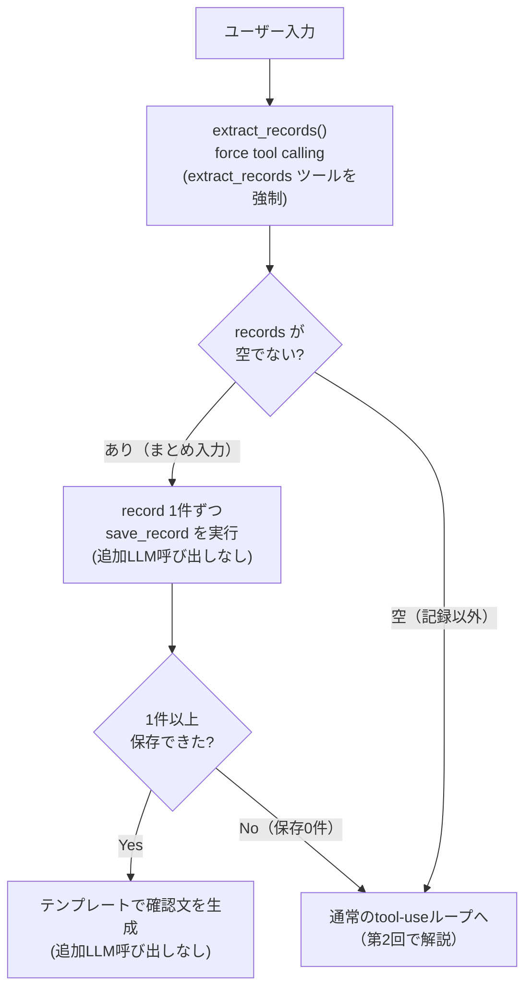

## はじめに

[前回](/blog/ai-arch-02-agent-loop/)は、「入力 → LLM → ツール実行 → 結果を戻す」を繰り返すエージェントループを扱いました。あのループには実は**手前**にもう1段あります。今回はそこ——「9時に母乳、10時から昼寝、11時におむつ」という1つの発言から複数の記録を1回のLLM呼び出しで構造化する**force tool calling**——を解説します。

**この記事で分かること**

- `tool_choice` でLLMに「このツールしか呼べない」状態を作る方法
- JSON SchemaのenumとrequiredをLLMへの実質的な指示にする考え方
- 「記録でなければ空リストを返す」ことで通常のツール使用ループへ安全にフォールバックする設計

**対象読者**: Tool Use / Function Callingは使えるが、1回の入力から複数の構造化データをまとめて取りたい人

## 題材アプリ

[koto-log](https://github.com/Kaaaaazuya/koto-log) — LINEで動く育児記録エージェント（詳細は[第1回](/blog/ai-arch-01-llm-responsibility/)参照）。本記事のコードは[コミット `20845c0` 時点](https://github.com/Kaaaaazuya/koto-log/tree/20845c04ee5716d323525ed765c61fc0bb1be34a)の [`src/kotolog/agent/extractor.py`](https://github.com/Kaaaaazuya/koto-log/blob/20845c04ee5716d323525ed765c61fc0bb1be34a/src/kotolog/agent/extractor.py) のものです。

## 課題: まとめて書かれた入力を1件ずつ処理させると無駄が多い

育児記録は「9時に母乳、10時から昼寝、11時におむつ」のようにまとめて送られてくることが珍しくありません。寝かしつけの合間にスマホを開いた親が、思い出した分を一気に打つからです。

これを前回のツール使用ループにそのまま投げると、LLMは`save_record`を3回続けて呼ぶか、あるいは1回の応答に複数のtool_callsを詰め込むかをモデル任せで判断することになります。挙動がモデル依存になり、抜け漏れが起きても検知しづらくなります。

さらに厄介なのは、この時点ではまだ「記録」なのか「質問」なのか「集計依頼」なのかが分かっていないことです。「今日は何回飲んだ？」も「150に直して」も同じ入口から来ます。**まず記録かどうかを判定しつつ、記録なら複数件を確実に構造化する**、という2つの仕事を1回のLLM呼び出しで済ませたいという要求が生まれます。

## 全体像



抽出専用の`extract_records`は保存をせず、**記録候補を返すだけ**です。実際の保存は呼び出し元の`handle()`がループで`save_record`を実行します。これにより「記録を判定するLLM呼び出し」と「DBへ保存する処理」が分離され、確認文の生成にも追加のLLM呼び出しは不要になります。

## 実装

### 1. tool_choiceで「このツールしか呼べない」状態を作る

通常のツール使用ループは、`save_record`など4つのツールをLLMに渡します。どれを呼ぶかはLLM自身の判断（`tool_choice`未指定＝auto）に委ねます。一方、抽出専用の呼び出しはツールを1つだけ渡し、`tool_choice`でそのツールを名指しして強制します。

```python
# src/kotolog/agent/extractor.py
def extract_records(text: str, llm_client) -> tuple[list[dict], str | None]:
    """テキストから育児記録リストを抽出する。

    Returns:
        (records, child_name): records は抽出された記録リスト（記録でない場合は空リスト）、
        child_name はユーザーが明示した対象児名（未指定なら None）。
    """
    resp = llm_client.complete(
        messages=[
            {"role": "system", "content": _EXTRACT_SYSTEM},
            {"role": "user", "content": text},
        ],
        tools=[_EXTRACT_TOOL],
        tool_choice={"type": "function", "function": {"name": "extract_records"}},
        operation="extract",
    )
    message = resp.choices[0].message
    tool_calls = getattr(message, "tool_calls", None)
    if not tool_calls:
        return [], None
    try:
        args = json.loads(tool_calls[0].function.arguments)
    except (json.JSONDecodeError, AttributeError):
        return [], None
    records = args.get("records") or []
    child_name = args.get("child") or None
    return records, child_name
```

`tools`に渡す配列を`_EXTRACT_TOOL`だけにした上で、さらに`tool_choice`で名指しするのは冗長に見えますが意図的です。ツールが1つしかなくても`tool_choice`を省略すると、モデルによってはツールを呼ばずに本文で答えてしまうことがあります。「候補を1つに絞る」と「そのうちの1つを強制する」は別の制約で、両方かけて初めて出力形式が安定します。

テスト（[`tests/unit/test_extractor.py`](https://github.com/Kaaaaazuya/koto-log/blob/20845c04ee5716d323525ed765c61fc0bb1be34a/tests/unit/test_extractor.py)）には、この`tool_choice`の形式を確認するケースもあります。LiteLLMが要求するのは**OpenAI仕様の形**（`{"type": "function", "function": {"name": ...}}`）です。Anthropicネイティブ形式のまま渡すと、本番で検証エラーになります。あえてこの形に固定しているという注記が添えられています。プロバイダ抽象化の裏でこうした仕様差が残っている点は、次々回（LiteLLMによるプロバイダ切替）で改めて扱います。

### 2. JSON Schemaのenum・requiredを「実質のプロンプト」にする

`_EXTRACT_TOOL`のJSON Schemaは、自然文の指示以上にLLMの出力を縛ります。

```python
# src/kotolog/agent/extractor.py
_EXTRACT_TOOL = {
    "type": "function",
    "function": {
        "name": "extract_records",
        "description": (
            "メッセージに含まれる全ての育児記録（授乳・睡眠・おむつ・体温・離乳食・"
            "お風呂・薬・病院・外出・身長・体重）を抽出して返す。"
            "記録でない場合（質問・集計・修正・設定変更など）は records を空リストにする。"
        ),
        "parameters": {
            "type": "object",
            "properties": {
                "records": {
                    "type": "array",
                    "items": {
                        "type": "object",
                        "properties": {
                            "type": {
                                "type": "string",
                                "enum": [
                                    "feeding", "sleep", "diaper", "temp",
                                    "baby_food", "bath", "medicine",
                                    "hospital", "outing", "height", "weight",
                                ],
                            },
                            "started_at": {
                                "type": "string",
                                "description": "相対表現のままでよい（例: 9時、さっき、14:30）",
                            },
                            # ...(略: sub_type / amount / unit / ended_at / note)
                        },
                        "required": ["type", "started_at"],
                    },
                },
                "child": {"type": "string", "description": "対象児名（明示時のみ）"},
            },
            "required": ["records"],
        },
    },
}
```

`type`を自由文字列ではなく11種の`enum`にしたことで、LLMは「おしっこ交換」を`diaper`以外の値に開こうとしなくなります。`required: ["type", "started_at"]`も同様に、時刻が読み取れない記録候補を省略なしで無理やり埋めることを防ぎます。時刻の確定はアプリ側の役目であり、LLMには「さっき」のような相対表現のまま渡させます。

descriptionの「記録でない場合は records を空リストにする」という一文も重要です。これがあることで、質問や集計依頼が来たときにLLMは無理に記録をでっち上げず、空配列という「該当なし」を表現する正常な出力を選べます。

なお、実装はこのスキーマ単体に頼っていません。3文の短いシステムプロンプト（`_EXTRACT_SYSTEM`）を併用し、「全ての記録を抽出せよ」「記録でなければ空リストにする」という同じ指示を自然文でも重ねています。schemaが「実質のプロンプト」だとしても役割の宣言まで代替するわけではなく、構造的な制約と自然文の指示は重ねがけする関係にあります。

### 3. 空なら通常のツール使用ループへフォールバックする

`extract_records`はあくまで候補を返すだけで、保存とループへの分岐は呼び出し元の`handle()`が行います。

```python
# src/kotolog/agent/loop.py（handle() 内・抜粋）
extracted, child_name_hint = extract_records(user_text, self.client)
# ...(略: レート制限カウント、child_id解決)

if extracted:
    saved = []
    for record in extracted:
        try:
            result = executor.execute("save_record", record)
            if result.get("ok") and result.get("record"):
                saved.append(result["record"])
        except Exception:  # noqa: BLE001
            pass
    if saved:
        children = crud.list_children(self.conn)
        display_name = crud.get_child_name(self.conn, child_id) if len(children) > 1 else None
        reply = format_confirmation(saved, child_name=display_name)
        if line_user_id:
            self._save_session_context(line_user_id, history, user_text, reply)
        return reply

# extracted が空、または1件も保存できなければ通常ループへ続く
messages: list[dict] = [{"role": "system", "content": self.system_prompt}]
```

`extracted`が空リストのとき（質問・集計・修正など）は、通常ループへ静かに流れ落ちます。**抽出はできたが1件も保存に成功しなかった**とき（`executor.execute`が例外を投げた場合など）も同様です。抽出結果を過信して早期returnで固定せず、「保存できて初めて確定応答にする」という一段防御的な作りです。

保存が成功した場合の確認文は、`format_confirmation`がテンプレートで組み立てるだけで**追加のLLM呼び出しを挟みません**。1回のまとめ入力に対してLLM呼び出しは`extract_records`の1回だけで完結します。

## 設計判断とトレードオフ

| 案                                                               | 採否 | 理由                                                                                        |
| ---------------------------------------------------------------- | ---- | ------------------------------------------------------------------------------------------- |
| 全ての発言でまず`extract_records`を強制呼び出し（採用）          | ✅   | まとめ入力・単発記録・質問を同じ入口で扱え、事前判定コードが不要になる                      |
| ルールベースで「まとめ入力っぽいか」を事前判定してから抽出を呼ぶ | ❌   | 判定自体が自然文の解釈を要し、結局LLMに戻ってくる。複雑さが増えるだけで得るものが少ない     |
| 記録でなければ空リストを返し通常ループへフォールバック（採用）   | ✅   | 「抽出」と「意図判断」の責務を分離できる。質問・集計・修正は通常ループの4ツールに任せられる |
| `extract_records`単体で意図判定まで完結させる                    | ❌   | ツールスキーマが肥大化し、「抽出」と「分類」という別の役目が1つのツールに混ざる             |
| `tool_choice`で単一ツールを強制 + enum/requiredで厳格化（採用）  | ✅   | 出力形式のブレを構造として防げる。プロンプトの自然文指示より制約が強い                      |
| プロンプトの自然文だけで「JSON形式で返して」と指示する           | ❌   | 小型ローカルLLMがフォーマットを外す事象にkoto-logで実際に遭遇している（詳細は次回）         |

見落とされがちなトレードオフが1つあります。`extract_records`は**単発の記録や質問のときも毎回必ず1回呼ばれます**。まとめ入力でなくても「まず抽出を試す」設計そのものが、常に+1回分のLLM呼び出しコストを生みます。実際、[ADR-0002（トークン使用量の最小計測）](https://github.com/Kaaaaazuya/koto-log/blob/20845c04ee5716d323525ed765c61fc0bb1be34a/docs/adr/0002-token-usage-measurement.md)では「操作回数の割に入力トークンが多い」という観察から、`extract`と`loop`を呼び出し種別として区別して計測する仕組みが後付けされています。判定ロジックを持たないシンプルさと引き換えに、コストは可観測性側で監視するという役割分担です。この計測の仕組み自体は今シリーズの後半（可観測性の回）で扱います。

## 動作確認 / 評価

[`tests/unit/test_extractor.py`](https://github.com/Kaaaaazuya/koto-log/blob/20845c04ee5716d323525ed765c61fc0bb1be34a/tests/unit/test_extractor.py)には、`FakeLLMClient`でレスポンスをスクリプト化したテストが並んでいます。主なものは次の通りです。

- `test_extract_returns_multiple_records`: 1つの発言から`feeding` / `diaper` / `sleep`の3件が1回の呼び出しで抽出されることを確認
- `test_extract_returns_empty_for_query`: 「今日は何回飲んだ？」のような質問には空リストが返ることを確認
- `test_extract_forces_tool_choice`: `tool_choice`が期待通りの形で渡されることを確認
- `test_extract_passes_extract_tool_only`: `tools`に`extract_records`以外が混ざっていないことを確認
- `test_extract_tool_schema_includes_p10_types`: 後から追加した記録種別（離乳食・お風呂・薬など）が`enum`に反映されていることを確認

これらのテストは「LLMの応答が期待通りだったときの分岐」を検証するものです。実際のLLMが常に`tool_choice`の指示に従うとは限らない点までは保証しません。その前提が崩れるケース——小型ローカルLLMは構造化`tool_calls`を外し、本文にJSONを吐いてしまうことがあります——への備えは、次回のテーマそのものです。

## まとめ

- `tool_choice`でツールを1つに絞ると、LLMの出力形式を「お願い」ではなく制約として固定できる
- JSON Schemaの`enum`・`required`は、自然文の指示より強くLLMの出力を縛る「実質のプロンプト」になる
- 「記録でなければ空リストを返す」ことで、抽出専用の呼び出しと通常のツール使用ループを安全に接続できる。ただしこの構成は毎回+1回のLLM呼び出しコストを生むトレードオフも伴う

<!-- textlint-disable ja-technical-writing/no-doubled-joshi -->

次回は、この`tool_choice`による強制が効かないケース——小型ローカルLLMが構造化`tool_calls`を外して本文にJSONを書いてしまう現象——への防御的な解析処理を解説します。

<!-- textlint-enable ja-technical-writing/no-doubled-joshi -->

## 参考

- [koto-log リポジトリ](https://github.com/Kaaaaazuya/koto-log)（本記事はコミット `20845c0` 時点のコードに基づく）
- [前回: エージェントループの最小実装](/blog/ai-arch-02-agent-loop/)
</content>
