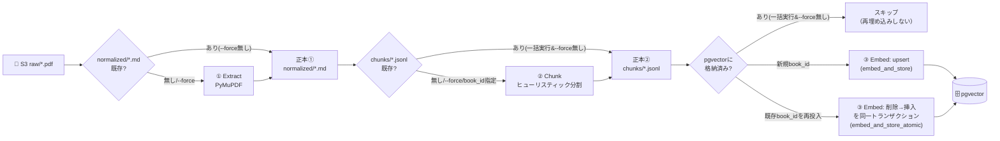

## はじめに

RAGという言葉の意味は[前回の入口記事](/blog/intro-what-is-rag/)で図解しました。今回からは、その実物パイプラインを実装レベルで各論として解説していきます。

このシリーズは本来[第3回](/blog/ai-arch-03-force-tool-calling/)（koto-logのforce tool calling）の続きとして第4回以降を進める予定でしたが、7月のブログ戦略見直しで「RAG編を先行して書く」方針に切り替えました。第4〜7回（koto-logのローカルLLM対応・LiteLLM抽象化・可観測性・Evals）は後日改めて出します。今回からしばらくは題材が[biblio-rag](https://github.com/Kaaaaazuya/biblio-rag)（日本語書籍RAGパイプライン）に移ります。

**この記事で分かること**

- 取り込み処理をExtract（抽出）→Chunk（分割）→Embed（埋め込み）の3層に分ける設計思想
- 各層の中間出力を「正本」とし、チューニングのたびに前段をやり直さずに済ませる仕組み
- 増分実行（スキップ）と、再投入時の原子的な削除→挿入
- ローカル（Ollama）と本番想定（Bedrock）を1つの抽象で切り替える構造

**対象読者**: RAGパイプラインを自作しようとしていて、「抽出・分割・埋め込みをどう分割し、どこまでファイルに残すか」で迷っている人

## 題材アプリ

[biblio-rag](https://github.com/Kaaaaazuya/biblio-rag) — 購入済みの日本語PDF書籍を入力に、検索対象となるベクトルインデックスを構築する取り込みパイプラインです（詳細は[入口記事](/blog/intro-what-is-rag/)参照）。

本記事のコードは[コミット `c62450a` 時点](https://github.com/Kaaaaazuya/biblio-rag/tree/c62450a954a5f6326ed7baa58c110859b4170a44)の [`workers/`](https://github.com/Kaaaaazuya/biblio-rag/tree/c62450a954a5f6326ed7baa58c110859b4170a44/workers) 以下のものです。

## 課題: 一番重い処理を、チューニングのたびにやり直したくない

書籍1冊のPDFをテキスト化するのは、フォントサイズの相対判定から見出しを復元する処理を含み、それなりに重い処理です。一方で実際にチューニングが発生するのは、抽出結果を受け取った後の工程がほとんどです。チャンクサイズを800字にすべきか600字にすべきか、埋め込みモデルをどれにするか、検索の重み付けをどう調整するか——こうした試行錯誤は本来「抽出済みのテキスト」さえあれば完結する話です。そのたびにPDFを開き直す理由はありません。

素朴に1本のスクリプトで「PDF→抽出→分割→埋め込み→格納」を直列に書いてしまうと、チャンクサイズを1つ変えて試すだけでも毎回PDFの抽出からやり直すことになります。書籍が増えるほど、この無駄なやり直しコストは積み上がります。

## 全体像: 3層に分け、各層の出力を「正本」にする

biblio-ragはこの問題を、各層の出力をファイルとして残し「正本」とすることで解決しています（[ADR 0001](https://github.com/Kaaaaazuya/biblio-rag/blob/c62450a954a5f6326ed7baa58c110859b4170a44/docs/adr/0001-layer-separation.md)）。「正本」とは、その層より後ろの工程を作り直すための元データという意味です。



3層とも「対象の出力キーが既にS3にあれば処理をスキップする」という同じ増分実行パターンを踏襲しています。ただし判定条件には層ごとに違いがあります。①Extractは常にこの判定が働きますが、②Chunkと③Embedは「一括実行（`book_id`を指定せず全件処理）」のときだけスキップが働き、`book_id`を明示すれば既存でも常に再実行されます。さらに③Embedだけは、再実行が「スキップ」以外の場合に処理内容そのものが分岐します。新規の`book_id`ならそのまま`upsert`します。既にpgvectorに格納済みの`book_id`を再投入する場合は、既存チャンクの削除と新規チャンクの挿入を同一トランザクションで行う`embed_and_store_atomic`に切り替わります。削除済みだが未投入という中間状態を避けるこの設計の詳細は、[`workers/embed/pipeline.py`](https://github.com/Kaaaaazuya/biblio-rag/blob/c62450a954a5f6326ed7baa58c110859b4170a44/workers/embed/pipeline.py)や別の記事で改めて扱います。

## 実装

### 1. 層境界を「正本ファイル」で守る

①Extractの実行部分は、S3上に対応する`normalized/*.md`が既にあればスキップし、なければ抽出してS3へ書き戻します。

```python
# workers/extract/extract.py
def _cli(argv: list[str]) -> int:
    parser = argparse.ArgumentParser(description="① 抽出: PDF → 構造つき Markdown")
    parser.add_argument("paths", nargs="*", help="ローカル PDF（省略時は S3 の raw/ を処理）")
    parser.add_argument("--force", action="store_true", help="処理済み(.md)も再生成（洗い替え）")
    args = parser.parse_args(argv)

    from workers.storage import ObjectStore

    store = ObjectStore()

    if args.paths:
        for arg in args.paths:
            pdf = Path(arg)
            stem = pdf.stem
            norm_key = f"{NORM_PREFIX}{stem}.md"
            md = extract_pdf_to_markdown(pdf)
            store.put_text(norm_key, md)
            print(f"{pdf} -> s3://{store.bucket}/{norm_key} ({len(md)} chars)")
        return 0

    keys = store.list_pdfs()
    if not keys:
        print(
            f"S3 に PDF がありません（{store.bucket}/raw/）。"
            "workers.upload で投入するか MinIO コンソールからアップロードしてください",
            file=sys.stderr,
        )
        return 1
    for key in keys:
        stem = Path(key).stem
        norm_key = f"{NORM_PREFIX}{stem}.md"
        if not args.force and store.key_exists(norm_key):
            print(f"スキップ（既存）: {norm_key}")
            continue
        md = extract_pdf_to_markdown(store.get_bytes(key))
        store.put_text(norm_key, md)
        print(f"s3://{store.bucket}/{key} -> s3://{store.bucket}/{norm_key} ({len(md)} chars)")
    return 0
```

`store.key_exists(norm_key)`が「正本」の存在確認そのものです。`normalized/*.md`があれば、②Chunk以降のチューニングはPDFに一切触れません。ADR 0001はこの制約を「②は`normalized/*.md`のみを入力としPDFを再オープンしない」と明記しています。実際`workers/chunk/chunk.py`のコードはどこにも`fitz`（PyMuPDF）へのimportがありません。層の境界は「コード上どのモジュールがどのファイルしか読まないか」で機械的に守られています。

②Chunkと③Embedの`_cli`にも同じ形の増分実行判定があります（[`workers/chunk/chunk.py`](https://github.com/Kaaaaazuya/biblio-rag/blob/c62450a954a5f6326ed7baa58c110859b4170a44/workers/chunk/chunk.py)・[`workers/embed/pipeline.py`](https://github.com/Kaaaaazuya/biblio-rag/blob/c62450a954a5f6326ed7baa58c110859b4170a44/workers/embed/pipeline.py)）。3層とも独立したCLI（`task extract` / `task chunk` / `task embed`、まとめて`task ingest`）として実行できます。これは「層ごとに再実行したい」という要求から自然に出てくる形です。

### 2. Chunk層: インターフェースだけ固定し、アルゴリズムは差し替え可能にする

②Chunk層は抽象クラス`Chunker`で契約だけを定義し、既定実装として`HeuristicChunker`（文字数＋句点＋見出し境界によるヒューリスティック分割）を差し込む構造になっています。

```python
# workers/chunk/base.py
"""② チャンク層のインターフェース契約（ADR 0007）。

分割戦略を将来差し替えられるよう抽象化する（Embedder / VectorStore と同じ思想）。
既定実装は HeuristicChunker。将来 埋め込みベース / LLM 版を差し込める。
"""

from __future__ import annotations

from abc import ABC, abstractmethod


class Chunker(ABC):
    @abstractmethod
    def chunk(self, md: str, meta: dict) -> list[dict]:
        """構造つき Markdown をチャンク辞書のリストに変換する。"""
        ...
```

この記事では、なぜヒューリスティックを選んだのか（semantic chunkingやLLM判定との比較）までは踏み込みません。分割アルゴリズムの詳細と設計判断は次回の記事で扱います。ここで押さえたいのは、③Embed層が「②の出力である`chunks/*.jsonl`」だけを見ていて、②の内部実装が何であるかを一切知らないという点です。この分離があるおかげで、`Chunker`の実装を差し替えても③以降は無傷で済みます。

### 3. Embed層: 埋め込みプロバイダをローカル/本番で切り替える

③Embed層も同じ抽象化の思想を、埋め込みモデルとベクトルDBの2箇所に適用しています。開発ではOllamaの`bge-m3`、本番想定ではBedrock Titan V2に切り替える分岐は、環境変数1つが起点です。

```python
# workers/embed/pipeline.py
def make_embedder() -> Embedder:
    """EMBED_BACKEND 環境変数に応じた Embedder を返す。"""
    if config.EMBED_BACKEND == "bedrock":
        from .bedrock_embedder import BedrockEmbedder

        return BedrockEmbedder(config.BEDROCK_EMBED_MODEL, config.EMBED_DIM, config.AWS_REGION)
    return OllamaEmbedder(config.OLLAMA_HOST, config.EMBED_MODEL, config.EMBED_DIM)


def active_embed_model() -> str:
    """現在の EMBED_BACKEND に対応するモデル名を返す（embed_model カラムに格納する値）。"""
    if config.EMBED_BACKEND == "bedrock":
        return config.BEDROCK_EMBED_MODEL
    return config.EMBED_MODEL


def embed_and_store(
    records: list[dict], embedder: Embedder, store: VectorStore, embed_model: str = ""
) -> int:
    """チャンク群を埋め込み、格納する。格納件数を返す。"""
    if not records:
        return 0
    vectors = embedder.embed([r["text"] for r in records])
    model_to_use = embed_model or active_embed_model()
    records = [{**r, "embed_model": model_to_use} for r in records]
    store.upsert(records, vectors)
    return len(records)
```

`Embedder`と`VectorStore`はどちらも抽象クラス（[`workers/embed/base.py`](https://github.com/Kaaaaazuya/biblio-rag/blob/c62450a954a5f6326ed7baa58c110859b4170a44/workers/embed/base.py)）で、`embed_and_store`自身はOllamaかBedrockかを知りません。埋め込みベクトルには次元（1024次元で開発・本番共通）以外の制約を課さないことで、モデルを変えても呼び出し側のコードは変わらない作りです。ただし埋め込みモデルが変わると意味空間そのものが変わるため、`chunks`テーブルには`embed_model`カラムを持たせ、モデルの系譜を記録しています。この抽象を軸にした開発/本番の差し替え設計そのものは、シリーズの別の回で改めて深掘りします。

なお、`docs/design.md`が描く「本番はS3イベント通知→SQS→Lambda連鎖で非同期に実行する」という2ndステージのアーキテクチャは、[ADR 0011](https://github.com/Kaaaaazuya/biblio-rag/blob/c62450a954a5f6326ed7baa58c110859b4170a44/docs/adr/0011-aws-serverless-pipeline.md)として設計されています。[`workers/lambda_fns/`](https://github.com/Kaaaaazuya/biblio-rag/tree/c62450a954a5f6326ed7baa58c110859b4170a44/workers/lambda_fns)のLambdaハンドラ実装とLocalStackでの検証（`tests/test_localstack_e2e.py`）まで進んでいます。ただし現時点のREADMEが明記する通り、実運用しているのは本記事で扱ったローカル直列版（MVP）で、AWS化・非同期化は「2ndステージ」の位置づけです。今回の3層構成・正本ファイルという設計は、直列実行・SQS連鎖のどちらでも変わらない骨格として最初に固められています。

## 設計判断とトレードオフ

| 案                                                                                | 採否 | 理由                                                                                                       |
| --------------------------------------------------------------------------------- | ---- | ---------------------------------------------------------------------------------------------------------- |
| 抽出→分割→埋め込みを3層に分離し、各層の出力をファイルで正本化（採用）             | ✅   | チューニングの大半（分割・埋め込み）が発生する層だけ再実行すれば済み、最も重い抽出をやり直さずに済む       |
| 1本のスクリプトでPDFから直列にpgvectorまで書き切る                                | ❌   | チャンクサイズや埋め込みモデルを1つ変えるだけでもPDF抽出からやり直しになり、試行錯誤のコストが線形に膨らむ |
| 正本を中間ファイル（S3/ローカルディスク）として残す（採用）                       | ✅   | 各層をCLIとして独立実行でき、「今日はチャンクだけ試す」といった部分的なやり直しが可能になる                |
| 正本を持たずメモリ上でパイプラインを繋ぐ（ストリーム処理）                        | ❌   | 途中結果を検査・再利用できず、書籍本文を再度PDFから読み直す以外に後戻りの手段がなくなる                    |
| 増分実行（既存キーはスキップ、`--force`で明示的に洗い替え）（採用）               | ✅   | 新しい書籍を追加するたびに全冊を処理し直す必要がなくなる。書籍が増えるほど効果が大きい                     |
| 常に全件を再処理する                                                              | ❌   | 冊数が増えるとバッチ実行のたびに不要な埋め込みAPI呼び出し・DB書き込みが積み上がる                          |
| 再投入時は削除→挿入を同一トランザクションにする（`embed_and_store_atomic`、採用） | ✅   | 削除後・挿入前のクラッシュで「チャンクが消えたまま」の中間状態が生じるのを防げる                           |
| 再投入を「先に全削除→後で挿入」の2ステップに分けて実行する                        | ❌   | 途中で失敗すると検索対象のチャンクが一時的にゼロになる。運用中のサービスでは許容しづらい                   |

## 動作確認

このパイプラインは`task ingest`（`extract` → `chunk` → `embed`を順に実行するタスク定義、[`Taskfile.yml`](https://github.com/Kaaaaazuya/biblio-rag/blob/c62450a954a5f6326ed7baa58c110859b4170a44/Taskfile.yml)）でエンドツーエンドに動かせます。1回目の実行では全書籍が処理され、2回目以降は各層とも「スキップ（既存）」のログだけが出ることで、正本ファイルを起点にした増分実行が機能していることを確認できます。`task chunk -- --force`のように層を指定して`--force`を付ければ、その層だけを狙って再実行できます。各層のより詳しい振る舞い（チャンク分割の中身、Embedder/VectorStoreの差し替え、原子的再投入の内部）は、それぞれ後続の各論記事のテストコードとあわせて扱います。

## まとめ

- biblio-ragの取り込みパイプラインはExtract→Chunk→Embedの3層に分かれ、各層の出力ファイルを「正本」として残す設計になっている
- 正本があることで、最も重い抽出処理を再実行せずに、分割や埋め込みだけをチューニングできる
- 増分実行（既存ならスキップ）と、再投入時の原子的な削除→挿入が、この構成の上に組み合わさっている
- ローカル（Ollama）と本番想定（Bedrock）の切り替えも同じ抽象化の思想の延長線上にある。SQS×Lambdaによる非同期化は設計・検証済みだが、現状動いているのは本記事のローカル直列版

RAGの全体像は[前回の入口記事](/blog/intro-what-is-rag/)、RAG編の続きとして、次回はこのパイプラインの②Chunk層——分割に「AIを使わない」という判断——を掘り下げます。

## 参考

- [biblio-rag リポジトリ](https://github.com/Kaaaaazuya/biblio-rag)（本記事はコミット `c62450a` 時点の`workers/`のコードに基づく）
- [ADR 0001: 層分離と中間成果物（normalized / chunks を正本）](https://github.com/Kaaaaazuya/biblio-rag/blob/c62450a954a5f6326ed7baa58c110859b4170a44/docs/adr/0001-layer-separation.md)
- [biblio-rag docs/design.md](https://github.com/Kaaaaazuya/biblio-rag/blob/c62450a954a5f6326ed7baa58c110859b4170a44/docs/design.md)
- [前回: RAGとは何か（入口ハブ記事）](/blog/intro-what-is-rag/)
- [第3回: Force Tool Callingで一括構造化抽出する](/blog/ai-arch-03-force-tool-calling/)
