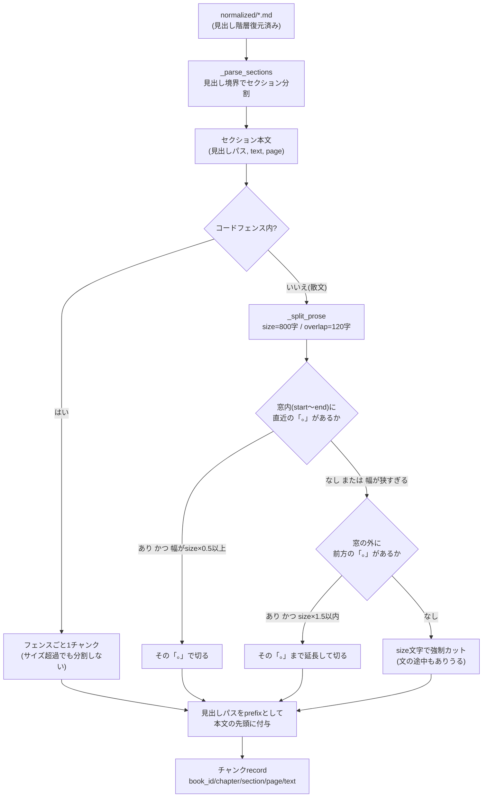

## はじめに

[前回](/blog/ai-arch-08-rag-pipeline/)は、日本語書籍RAG「biblio-rag」の取り込みパイプライン全体（Extract → Chunk → Embed）を扱いました。今回はその中の②チャンク層、つまり抽出済みMarkdownを検索単位（チャンク）に分割する部分を深掘りします。RAGの仕組み自体をまだ追っていない方は、先に入口記事の[「RAGとは何か」](/blog/intro-what-is-rag/)を読むと全体像がつかみやすいはずです。

チャンク分割は「賢くしよう」と思えばいくらでも賢くできる処理です。今回のテーマは、biblio-ragがその賢さをあえて選ばなかった理由です。

**この記事で分かること**

- チャンク分割の「賢さ」には段階があり、賢いほど良いとは限らないこと
- 文字数・句点・見出し境界だけで実用的な分割ができる理由
- 抽象インターフェースを挟むことで「後から賢くする」余地を残す設計

**対象読者**: RAGのチャンク分割で、どこまでAIに頼るべきか迷っている人

## 題材アプリ: 日本語書籍のRAGパイプライン

[biblio-rag](https://github.com/Kaaaaazuya/biblio-rag) — 購入済みの日本語PDF書籍を検索対象として取り込み、質問に答えるRAGチャットです。取り込みは①Extract（PDF→構造つきMarkdown）→②Chunk（Markdown→チャンクJSONL）→③Embed（チャンク→ベクトル、pgvectorへupsert）の3段構成です。本記事はこのうち②Chunkの実装（`workers/chunk/`）を扱います。

本記事のコードは[コミット `c62450a` 時点](https://github.com/Kaaaaazuya/biblio-rag/tree/c62450a954a5f6326ed7baa58c110859b4170a44)のものです。

## 課題: チャンク分割は「賢さ」を3段階から選べる

チャンク分割の実装には、賢さの異なる3つの選択肢があります。

1. **ヒューリスティック**: 文字数・句点・見出しなどの機械的なルールで切る
2. **semantic chunking**: 埋め込みモデルで文の意味的な近さを測り、話題が変わる箇所で切る
3. **LLM判定**: LLMに分割点や構造そのものを判断させる

賢さが上がるほど「意味のまとまりを壊さずに切れる」期待は高まりますが、代わりに非決定性・依存・（本番運用では）課金が増えます。biblio-ragの対象は**テキスト埋め込み済み・フォント階層が明確な日本語PDF**で、①Extract層がすでに見出し階層という強い構造情報を復元済みです。この前提のもとで、どこまで賢くする必要があるかを判断する必要がありました。

もう1つの制約は、biblio-ragが`chunks/*.jsonl`を「再実行できる正本」として扱う思想を持っていることです。分割方式を変えれば正本の再生成が発生するため、**同じ入力から常に同じ結果を得られる決定性**を運用上重視しています。

## 全体像: 見出し境界+文字数+句点のヒューリスティック

採用したのは方式1のヒューリスティックです。処理の流れは、まず見出し境界でセクションに分け、セクション内をさらに文字数と句点で分割します。



ポイントは2つです。1つはコードフェンス（` ``` `で囲まれた範囲）を原子単位として保護し、サイズを超えても分割しない点。もう1つは句点探索の優先順位です。まず窓の内側で後ろ向きに「。」を探し、それが窓の半分未満の位置にしか無い（＝短すぎるチャンクになる）場合だけ前方の「。」まで延長します。それでも見つからなければ、文字数で強制的に切ります。

## 実装

### Chunker ABCと差し替え可能設計

チャンク分割は`Chunker`という抽象クラスの背後に隠されています。ADRにも明記されている通り、これは③Embed層の`Embedder` / `VectorStore`と同じ「実装を差し替え可能にする」思想です。

```python
# workers/chunk/base.py
"""② チャンク層のインターフェース契約（ADR 0007）。

分割戦略を将来差し替えられるよう抽象化する（Embedder / VectorStore と同じ思想）。
既定実装は HeuristicChunker。将来 埋め込みベース / LLM 版を差し込める。
"""

from __future__ import annotations

from abc import ABC, abstractmethod


class Chunker(ABC):
    @abstractmethod
    def chunk(self, md: str, meta: dict) -> list[dict]:
        """構造つき Markdown をチャンク辞書のリストに変換する。"""
        ...
```

[全文](https://github.com/Kaaaaazuya/biblio-rag/blob/c62450a954a5f6326ed7baa58c110859b4170a44/workers/chunk/base.py)。抽象メソッドは`chunk()`ただ1つで、Markdown文字列とメタデータを受け取ってチャンク辞書のリストを返す契約だけを決めています。分割ロジックの中身には一切踏み込みません。

### HeuristicChunkerの分割ロジック

既定実装の`HeuristicChunker`は、この`Chunker`を実装したヒューリスティック版です。呼び出し側から見た入出力はこうなります。

```python
# workers/chunk/chunk.py
class HeuristicChunker(Chunker):
    """ADR 0007 のヒューリスティック分割（文字数 + 句点 + 見出し境界尊重）。"""

    def __init__(self, size: int = DEFAULT_SIZE, overlap: int = DEFAULT_OVERLAP):
        if overlap >= size:
            raise ValueError("overlap は size より小さくしてください")
        self.size = size
        self.overlap = overlap

    def chunk(self, md: str, meta: dict) -> list[dict]:
        """meta には book_id / title / author が必須。"""
        for key in ("book_id", "title", "author"):
            if not meta.get(key):
                raise ValueError(
                    f"メタデータ '{key}' は必須です（title・author はサイドカー JSON で指定）"
                )

        records: list[dict] = []
        idx = 0
        for path, body, page in _parse_sections(md):
            chapter = path[0] if path else None
            section = path[1] if len(path) > 1 else None
            prefix = " > ".join(path)
            for piece in _split_text(body, self.size, self.overlap):
                text = f"{prefix}\n{piece}" if prefix else piece
                records.append(
                    {
                        "book_id": meta["book_id"],
                        "chunk_index": idx,
                        "title": meta["title"],
                        "author": meta["author"],
                        "chapter": chapter,
                        "section": section,
                        "page": page,
                        "text": text,
                    }
                )
                idx += 1
        return records
```

`_parse_sections`が見出し境界でMarkdownをセクションに分け、セクションごとに`_split_text`で本文を分割します。見出しパス（例「第1章 設計の前提 > 1.1 目的とスコープ」）を各チャンクの本文先頭に付け、検索時にも文脈が失われないようにしています。

句点優先の分割本体が`_split_prose`です。全体像の図で示した「後ろ向きに探して、狭ければ前方に延長する」判断がそのままコードになっています。

```python
# workers/chunk/chunk.py
def _split_prose(text: str, size: int, overlap: int) -> list[str]:
    """文字数 + 句点優先 + overlap でテキストを分割する（コード外の散文用）。"""
    text = text.strip()
    if not text:
        return []
    chunks: list[str] = []
    start, n = 0, len(text)
    while start < n:
        end = min(start + size, n)
        if end < n:
            dot = text.rfind("。", start, end)
            if dot != -1 and (dot + 1 - start) >= size * 0.5:
                end = dot + 1
            else:
                fwd = text.find("。", end)
                if fwd != -1 and (fwd + 1 - start) <= size * 1.5:
                    end = fwd + 1
        chunk = text[start:end].strip()
        if chunk:
            chunks.append(chunk)
        if end >= n:
            break
        start = max(end - overlap, start + 1)
    return chunks
```

[全文はこちら](https://github.com/Kaaaaazuya/biblio-rag/blob/c62450a954a5f6326ed7baa58c110859b4170a44/workers/chunk/chunk.py)。コードフェンスの保護（`_split_text`）や見出し検出（`_parse_sections`）の実装は今回割愛しますが、いずれも正規表現とスタック構造だけで書かれた決定的な処理です。LLMはおろか、埋め込みモデルすら呼び出していません。

## 設計判断とトレードオフ

| 案                                          | 採否 | 理由                                                                                             |
| ------------------------------------------- | ---- | ------------------------------------------------------------------------------------------------ |
| ヒューリスティック（文字数+句点+見出し）    | ✅   | 決定的で無料・デバッグ容易。①が復元した見出し階層を活かせば、対象PDFが素直な範囲では破綻しにくい |
| semantic chunking（埋め込みで話題境界検出） | ❌   | 既に持つ埋め込み器を再利用でき追加コストはほぼゼロだが、MVP段階でその便益が薄い                  |
| LLM判定（分割点や構造をLLMに判断させる）    | ❌   | 品質は最も柔軟だが、非決定性・課金・遅延を持ち込む。対象PDFが素直な以上、過剰実装になる          |

ヒューリスティックにも弱点はあります。レイアウトが乱れた書籍や表・図の多い書籍では、文字数と句点だけでは分割品質が落ちえます。ここで効いてくるのが`Chunker`を抽象インターフェースにしておいた設計です。品質に不満が出た場合、コストの低い順に見直す計画がADRに明記されています。

1. semantic chunking（bge-m3の埋め込みを再利用、追加コストほぼゼロ）
2. それでも不足するならLLM判定（`Chunker`実装を差し替えるだけで済む）
3. **LLMは「評価役」として先に使う**と費用対効果が高い — 取り込み結果（チャンク境界・見出し検出）をオフラインでスコアリングし、ホットパス（毎回の取り込み処理）には入れない

この3番目の考え方が今回のポイントです。「LLMを使うかどうか」は二択ではなく、**分割そのものに使うレベルと、分割結果の採点だけに使うレベル**という粒度で選べます。採点であれば1回きりの実行で済み、非決定性やコストが本番運用に持ち込まれません。

## まとめ

biblio-ragのチャンク分割は、文字数・句点・見出し境界という決定的なルールだけで実装されています。対象PDFの前提（テキスト埋め込み済み・フォント階層明確）と、`chunks/*.jsonl`を正本として何度も再生成する運用が、この選択を後押ししました。一方で`Chunker`を抽象インターフェースにしておくことで、semantic chunkingやLLM判定への差し替え余地は残しています。品質に不満が出たときの見直し順序も、コストの低い施策から並んでいます。「LLMは評価役として先に使う」という発想は、分割精度に限らずAIプロダクトの改善サイクル全般に応用できる考え方です。

次回は、この差し替え可能設計がどう活きるかを、③Embed層の実例（開発環境Ollama/本番環境Bedrockの切り替え）で見ていきます。

## 参考

- [biblio-rag リポジトリ](https://github.com/Kaaaaazuya/biblio-rag)（本記事はコミット `c62450a` 時点のコードに基づく）
- [ADR 0007 — チャンク戦略](https://github.com/Kaaaaazuya/biblio-rag/blob/c62450a954a5f6326ed7baa58c110859b4170a44/docs/adr/0007-chunking-strategy.md)
- [前回: RAG取り込みパイプラインの全体設計](/blog/ai-arch-08-rag-pipeline/)
- [入口ハブ: RAGとは何か](/blog/intro-what-is-rag/)
