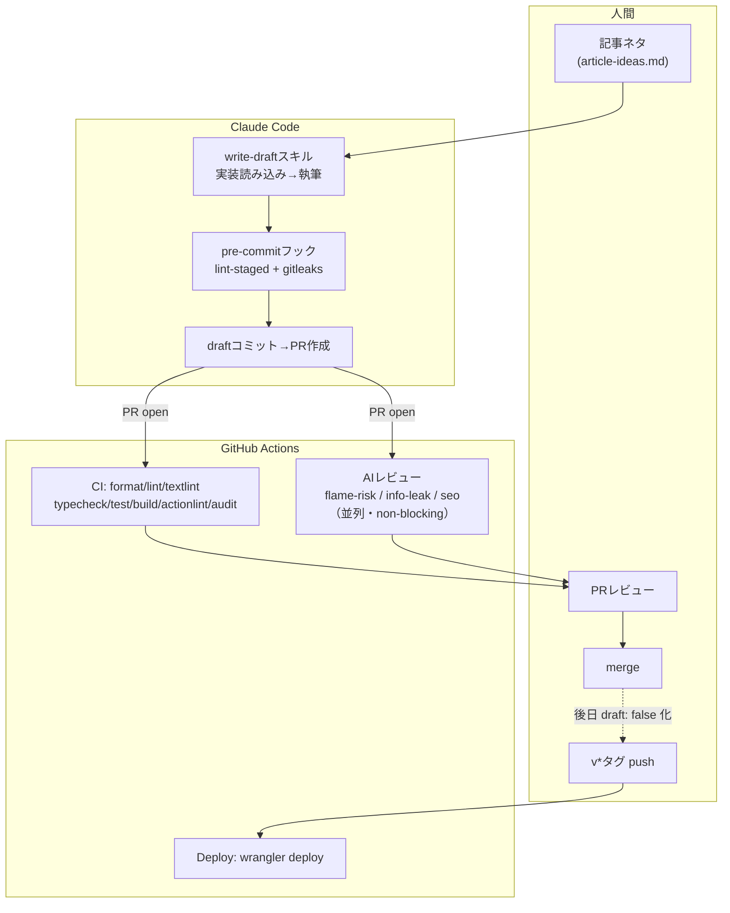

## はじめに

**2026年7月現在**、このブログはClaude Codeで運営しています。記事ネタを思いついてからサイトに公開されるまで、ドラフト生成・品質チェック・AIレビュー・人間レビュー・デプロイという工程を人間とClaude Code、CIで分担して回しています。

この記事は、Claude Code開発実践編（柱2）の入口ハブ記事です。全体のワークフローをまず俯瞰し、各工程の詳細は各論記事に譲ります。ワークフローは今後も変わっていくはずなので、半年ごとに更新版を出す定点観測記事として位置付けています。

**この記事で分かること**

- 記事が公開されるまでの全体フロー（人間・Claude Code・CIの担当分担）
- 各工程（ドラフト生成・品質ゲート・AIレビュー）が実際どう組まれているか
- どこまでを自動化し、どこを人間の判断に残しているか

**対象読者**: Claude Codeを個人開発やブログ運営に組み込みたい人、AIに書かせたコンテンツをどう品質担保するか迷っている人

## 題材アプリ

[dev-blog](https://github.com/Kaaaaazuya/dev-blog) — このブログ自体のリポジトリです（Astro + Cloudflare Workers）。

本記事のコードは[コミット `5025d81` 時点](https://github.com/Kaaaaazuya/dev-blog/tree/5025d818ac406d06e831439f25e86ae6bdbcacdc)のものです。このリポジトリはpublicで、`draft: true` の未公開記事もGitHub上では読める運用にしています（サイトには出ません）。

## 課題: AIが書く前提でどう品質を担保するか

Claude Codeに記事のドラフトを書かせると、執筆速度は上がりますが「実在しないコードを引用する」「主張と矛盾する図を出す」といった事故が起きえます。かといって毎回全文を人間が一から書き直すのでは、Claude Codeを使う意味が薄れます。

この問題への回答が「Claude Codeにドラフトを書かせる工程」と「機械的に検証する工程」「人間が最終判断する工程」を分けて直列に並べる、という構成です。

## 全体像



merge後すぐには公開されない点が特徴です。デプロイは `main` へのmergeではなく `v*` 形式のタグpushでのみ発火するため、「記事をmergeするタイミング」と「サイトに公開するタイミング」を分離できます。draftのままmergeしておき、レビューが済んで `draft: false` にしたタイミングで改めてタグを打つ、という運用です。

## 各工程の実際

### write-draftスキルによるドラフト生成

執筆規約は `docs/writing-guide.md`、各テーマの概要・該当コードは `docs/article-ideas.md` にまとめています。方向性は `docs/blog-strategy.md` です。Claude Codeはこれらを毎回読んでから書きます。スキル本体はこの3ファイルを前提知識として指定したうえで、素材収集・執筆・検証・コミットの手順を定義しています。

```markdown
# skills/write-draft/SKILL.md

### 1. 素材収集（記事を書く前に必ず）

- 題材リポジトリ（koto-log / biblio-rag）を shallow clone する。Claude Code編（cc-*）の題材はこのリポジトリ自体のため clone 不要（SHAはこのリポジトリのHEADを使う）
- `git rev-parse HEAD` でコミットSHAを控える（パーマリンク用）
- article-ideas.md の「該当コード」に挙がったファイルと関連ADRを**実際に読む**。記憶や推測でコードを書かない
- 引用するファイルは断片でなく**全体**を読む。記事の主張を補強・限定する周辺要素（例: スキーマと併用されるシステムプロンプト）があれば、隠さず記事で言及する
- 引用するコード片と実物が一致していることを確認する
```

（[引用元](https://github.com/Kaaaaazuya/dev-blog/blob/5025d818ac406d06e831439f25e86ae6bdbcacdc/skills/write-draft/SKILL.md)）

「記憶や推測でコードを書かない」を明文化しているのは、実際に取り違えや刈り込みすぎでレビュー指摘を受けた経験があるからです。この指摘をスキルへ書き戻すループの詳細は[次回記事](/blog/cc-02-skill-feedback/)で扱います。

### 品質ゲート（lint / textlint / gitleaks）

Claude Codeが書いたコード・記事は、コミット前とCIの二重で機械チェックを通します。まずコミット前は `simple-git-hooks` でpre-commit/pre-pushフックを固定しています。

```json
// package.json
"simple-git-hooks": {
  "pre-commit": "pnpm exec lint-staged && gitleaks git --staged --redact --no-banner",
  "pre-push": "pnpm typecheck"
},
"lint-staged": {
  "*.{astro,js,mjs,ts}": [
    "prettier --write",
    "eslint --fix --max-warnings=0"
  ],
  "*.{md,json,yml,yaml}": [
    "prettier --write"
  ]
}
```

（[引用元](https://github.com/Kaaaaazuya/dev-blog/blob/5025d818ac406d06e831439f25e86ae6bdbcacdc/package.json)）

`gitleaks git --staged` はステージ済み差分をシークレット漏洩の観点でスキャンします。write-draftスキルは `--no-verify` でのフック回避を禁止事項として明記しており、実際にこのドラフトのコミットもこのフックを通しています。

PR作成後はGitHub Actions側のCIで、pre-commitでは見ていない項目まで通します。

```yaml
# .github/workflows/ci.yml
jobs:
  quality:
    steps:
      - run: pnpm install --frozen-lockfile
      - name: Format check (Prettier)
        run: pnpm format:check
      - name: Lint (ESLint, 警告0)
        run: pnpm lint
      - name: Lint (textlint, 記事の表記ゆれ・文章校正)
        run: pnpm textlint
      - name: Type check (astro check)
        run: pnpm typecheck
      - name: Unit test (vitest)
        run: pnpm test
      - name: Build
        run: pnpm build
      - name: Lint workflow files (actionlint)
        uses: docker://rhysd/actionlint@sha256:b1934ee5f1c509618f2508e6eb47ee0d3520686341fec936f3b79331f9315667
  security:
    steps:
      - name: Secret scan (gitleaks)
        uses: gitleaks/gitleaks-action@e0c47f4f8be36e29cdc102c57e68cb5cbf0e8d1e # v3
      - name: Dependency audit (high以上で失敗)
        run: pnpm audit --audit-level=high
```

（[引用元](https://github.com/Kaaaaazuya/dev-blog/blob/5025d818ac406d06e831439f25e86ae6bdbcacdc/.github/workflows/ci.yml)、抜粋・ステップ名を残しuses/withの一部を省略）

textlintは `preset-ja-technical-writing` + `prh`（表記ゆれ辞書）で日本語の文章校正をします。pre-commitには入れず、CIと手動 `pnpm textlint` のみで回している判断の詳細は品質ゲート編（後述）に譲ります。

### claude-code-actionによる観点別AIレビュー

CIの機械チェックが通った後、記事の内容そのものを `claude-code-action` でレビューします。炎上リスク・情報漏洩・SEOの3観点をプロンプトファイルに分けて、matrixで並列実行します。

```yaml
# .github/workflows/ai-review.yml
review:
  needs: detect
  if: >
    needs.detect.outputs.should_run == 'true' &&
    github.event.pull_request.head.repo.full_name == github.repository
  strategy:
    fail-fast: false
    matrix:
      perspective: [flame-risk, info-leak, seo]
  steps:
    - id: prompt
      env:
        PERSPECTIVE: ${{ matrix.perspective }}
      run: |
        {
          echo 'content<<PROMPT_EOF'
          cat ".github/ai-review/prompts/${PERSPECTIVE}.md"
          echo 'PROMPT_EOF'
        } >> "$GITHUB_OUTPUT"
    - uses: anthropics/claude-code-action@e3ba649a81aa8af3ddca750d3ddc35901f29de19 # v1
      with:
        prompt: |
          REPO: ${{ github.repository }}
          PR NUMBER: ${{ github.event.pull_request.number }}
          ${{ steps.prompt.outputs.content }}
        claude_args: |
          --model claude-sonnet-5
          --max-turns 20
          --allowedTools "Read,Grep,Glob,Write,Bash(gh pr view:*),Bash(gh pr comment:*),Bash(gh api:*),Bash(cat:*)"
```

（[引用元](https://github.com/Kaaaaazuya/dev-blog/blob/5025d818ac406d06e831439f25e86ae6bdbcacdc/.github/workflows/ai-review.yml)、抜粋）

トリガーは2種類です。1つはPRの `opened`（新規追加ファイルのみ対象）。もう1つは `ai-review` ラベルの付与（追加+変更ファイルが対象）です。後者はレビュー後にラベルが自動で外れます。付け直せば再実行できます。各観点のレビュー結果は、マーカー行付きのPRコメントとして投稿・上書き更新されます。上記の `claude_args` にあるとおり `allowedTools` を絞っており、コメント投稿以外の書き込み系操作はできません。

観点の1つ「炎上リスク」のプロンプトは、不正確・断定的すぎる主張や誇張表現、特定の個人・企業への不公平な表現などをチェック対象にしています。

```markdown
# .github/ai-review/prompts/flame-risk.md

> **このレビューは補助的な観点です。最終的な公開判断は人間（編集者・著者）が行ってください。**

## チェック対象

### 1. 不正確・断定的すぎる主張

- 技術的な事実が間違っていないか、または一般化しすぎていないか
- 「〜が正解」という絶対化していないか（複数の正当な解がある場合の配慮）

### 4. 誤解を招く誇張表現

- 「1000倍高速」など数値を根拠なく誇張していないか
- ビフォーアフターの比較で、条件を隠していないか
```

（[引用元](https://github.com/Kaaaaazuya/dev-blog/blob/5025d818ac406d06e831439f25e86ae6bdbcacdc/.github/ai-review/prompts/flame-risk.md)、抜粋）

3観点に分けているのは1プロンプトに詰め込むと指摘が浅くなるためで、この判断の詳細は[AIレビューCI編](/blog/cc-03-ai-review-ci/)で扱います。

## 設計判断とトレードオフ

| 案                                          | 採否 | 理由                                                                                                        |
| ------------------------------------------- | ---- | ----------------------------------------------------------------------------------------------------------- |
| AIレビューをnon-blockingにする              | ✅   | 誤検知でPRがブロックされ続けるリスクを避け、最終判断は常に人間に残す                                        |
| merge後の即時デプロイ（mainへのpushで発火） | ❌   | 「記事をmergeするタイミング」と「サイトに公開するタイミング」が一致してしまい、レビュー後の微修正がしづらい |
| `v*` タグpushでのみデプロイ                 | ✅   | mergeとpublishを分離できる。draftのままmergeし、公開判断が固まってからタグを打てる                          |
| textlintをpre-commitに含める                | ❌   | 執筆途中の未完成な文章でも都度チェックが走ると執筆のテンポを損なう。CIと手動実行のみに配置                  |
| gitleaksをpre-commitとCIの両方に置く        | ✅   | pre-commitはコミット単位の即時フィードバック、CIは全履歴スキャンで見落としの保険になる                      |

自動化しない工程として明確に残しているのは「PRのmerge判断」と「draft解除（公開）」の2つです。AIレビューは指摘を出すだけで、マージ可否を決める権限は持ちません。write-draftスキル自体も「公開（`draft: false`化）は人間のレビュー後。スキルは行わない」と明記しています。ドラフト生成からAIレビューまでは自動化しつつ、最終判断は人間に残しています。これは「AIの出力を機械チェックと人間レビューの両方で受け止める」という一貫した方針によるものです。

## まとめ

このブログの記事は、次の流れで公開されます。

1. 記事ネタ一覧（`docs/article-ideas.md`）
2. write-draftスキルによるドラフト生成
3. pre-commit/CIの品質ゲート
4. claude-code-actionによる3観点AIレビュー
5. 人間のPRレビュー → merge
6. `v*` タグpushでのデプロイ

自動化した工程と人間に残した判断を分けることで、執筆速度を上げつつAI生成コンテンツ特有の事故を防ぐ構成にしています。

次の半年で変えたいことも控えています。レビュー指摘をスキルへ書き戻すループの明文化（[cc-02](/blog/cc-02-skill-feedback/)で先行して扱います）、品質ゲート自体の見直し（[cc-04](/blog/cc-04-quality-gates/)）、そして実際にうまくいかなかった試行錯誤の記録（[cc-06](/blog/cc-06-things-didnt-work/)）です。次回はこの全体像から分岐する各論として、write-draftスキルへレビュー指摘を還元するワークフローを掘り下げます。

## 参考

- [dev-blog リポジトリ](https://github.com/Kaaaaazuya/dev-blog)（本記事はコミット `5025d81` 時点のコードに基づく）
- [skills/write-draft/SKILL.md](https://github.com/Kaaaaazuya/dev-blog/blob/5025d818ac406d06e831439f25e86ae6bdbcacdc/skills/write-draft/SKILL.md)
- [.github/workflows/ci.yml](https://github.com/Kaaaaazuya/dev-blog/blob/5025d818ac406d06e831439f25e86ae6bdbcacdc/.github/workflows/ci.yml)
- [.github/workflows/ai-review.yml](https://github.com/Kaaaaazuya/dev-blog/blob/5025d818ac406d06e831439f25e86ae6bdbcacdc/.github/workflows/ai-review.yml)
- [.github/workflows/deploy.yml](https://github.com/Kaaaaazuya/dev-blog/blob/5025d818ac406d06e831439f25e86ae6bdbcacdc/.github/workflows/deploy.yml)
- [docs/architecture.md](https://github.com/Kaaaaazuya/dev-blog/blob/5025d818ac406d06e831439f25e86ae6bdbcacdc/docs/architecture.md)
