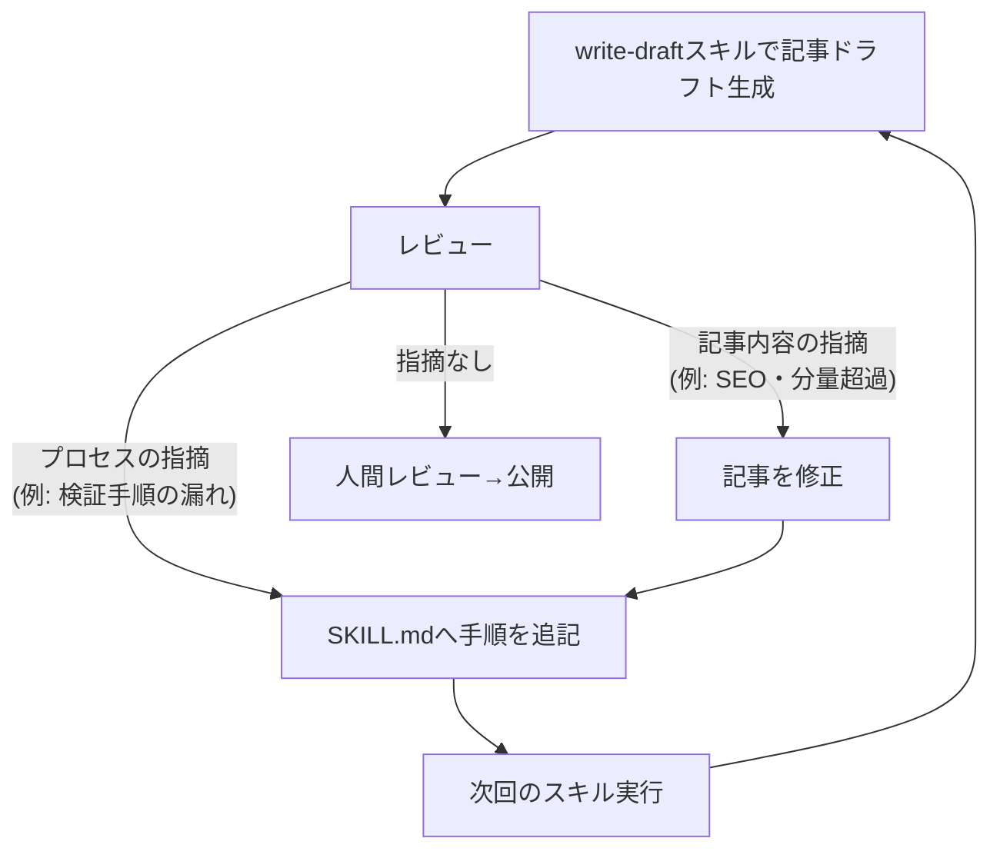

## はじめに

[前回](/blog/cc-01-blog-automation/)は、このブログの記事がIssueから公開までどう流れるか、全体像を定点観測しました。今回はその中の1工程——記事ドラフトを生成する `write-draft` スキル——に絞り、「レビューで出た指摘をどう仕組みに還元しているか」を実際のコミット履歴から見ていきます。

**この記事で分かること**

- レビュー指摘を口頭対応で終わらせず、スキル本文に書き戻す運用の実際
- 「プロセスの指摘」と「記事内容の指摘」で書き戻し先が変わること
- Git の変更履歴を証拠として使う、地味だが再現性の高い改善サイクル

**対象読者**: Claude Code のスキル（`skills/*/SKILL.md`）を運用しているが、レビューで得た学びを毎回スキルに反映できていない人

## 題材アプリ

[dev-blog](https://github.com/Kaaaaazuya/dev-blog)（このブログ自体のリポジトリ） — 記事執筆を `skills/write-draft/SKILL.md` というスキルに固定化し、Claude Code から呼び出して運用しています。本記事のコードは[コミット `5025d81` 時点](https://github.com/Kaaaaazuya/dev-blog/tree/5025d818ac406d06e831439f25e86ae6bdbcacdc)のものです。

## 課題: 同じレビュー指摘を二度受ける

スキルに執筆手順を書いておいても、レビューで見つかった不備をその場限りの口頭修正で終わらせると、次にスキルを呼び出したときには元の指示のまま実行されます。結果として、前回指摘した「引用コードのファイルパス取り違え」や「description の文字数オーバー」を次の記事でも繰り返すことになりかねません。

これは一般的な開発でも起きる問題ですが、Claude Code のスキルは「毎回同じ入力（SKILL.md）から出発する」という性質上、指摘の反映先を誤ると効果がゼロになる点が特徴的です。コードレビューでの指摘なら該当箇所を直せば直った状態が残りますが、スキル実行のプロセスに対する指摘は、SKILL.md 自体を直さない限り次回また同じ形で再発します。

`write-draft` スキルでは、この問題に対して「レビューで見つかった不備は、記事の修正とは別に SKILL.md へ書き戻す」というルールで運用しています。実際に何度かこのループが回っており、Git のコミット履歴にそのまま証拠が残っています。

## 全体像: 指摘からスキル反映までのループ



ポイントは、記事内容への指摘（SEO や分量など）であっても、それが「次も起きうる一般的な指摘」であれば記事の修正だけで終わらせず SKILL.md にも反映している点です。個別の記事を直すループと、スキルという仕組みを直すループが並走しています。

## 実装

### 実際に回った例(1): プロセスレビューでの指示不足の補強

`write-draft` スキルは最初、4行の「素材収集」節と3行の「検証」節しか持っていませんでした（[コミット `b38513f` 時点](https://github.com/Kaaaaazuya/dev-blog/blob/b38513f014f4f6297a8d071485d63b2591f71e77/skills/write-draft/SKILL.md)、全48行）。この状態でスキル単体を走らせて第3回記事（force tool calling編）のドラフトを生成しました。生成後のレビューで指示不足がいくつか見つかりました。その指摘は[コミット `dcae676`](https://github.com/Kaaaaazuya/dev-blog/commit/dcae67611b31ba3a6ce9903a1cbca9b64337ef33)でSKILL.mdへそのまま書き戻されています。

```markdown
# skills/write-draft/SKILL.md (コミット dcae676 時点、抜粋)

## 前提ツール

- pre-commit フックが `gitleaks git --staged` を実行する。環境に gitleaks が無い場合は先に導入する
  （apt版は `git` サブコマンド非対応のことがあるため、`go install github.com/zricethezav/gitleaks/v8@latest`
  が確実）。`--no-verify` での回避はしない

### 1. 素材収集（記事を書く前に必ず）

- 引用するファイルは断片でなく**全体**を読む。記事の主張を補強・限定する周辺要素
  （例: スキーマと併用されるシステムプロンプト）があれば、隠さず記事で言及する

### 2. 執筆

- mermaid図の分岐・矢印は、本文で説明する制御フローと1対1で一致させる。実装に存在する分岐
  （例: フォールバック経路）を図だけ省略しない
- ファイルパスコメントとパーマリンクは、**そのコードが実際に定義されているファイル**を指すこと。
  似た役割の別ファイルと取り違えない
```

コミットメッセージ（[dcae676](https://github.com/Kaaaaazuya/dev-blog/commit/dcae67611b31ba3a6ce9903a1cbca9b64337ef33)）には反映理由がそのまま書かれています。

> 第3回記事のドラフト生成をスキル単体で走らせたレビューで見つかった指示不足を補強する

指摘の内容は「引用コードのファイルパスコメントと実物の取り違え」「mermaid図が実装の分岐（フォールバック経路）を省略している」といったものでした。これらは記事レビューで一度見つかった不備ですが、原因はスキルの指示不足にあります。そこで個別の記事修正で終わらせず、手順そのものへ反映しました。このコミットだけでSKILL.mdは48行から59行に増えました。

### 実際に回った例(2): 記事内容レビューの指摘を一般化してスキルに戻す

もう1つの例は、記事内容そのものへのSEOレビューです。[コミット `fcd9bc5`](https://github.com/Kaaaaazuya/dev-blog/commit/fcd9bc574321cc1cfb5ad0fe7fa6756e6f2db79a)では、第3回記事の `description` が171字あり、推奨範囲（120〜160字）を超えていることを指摘されました。あわせて、主要キーワードがh2見出しに含まれていないことも指摘されました。このコミットでは記事本体を修正すると同時に、SKILL.mdへ以下の1行を追加しています。

```markdown
# skills/write-draft/SKILL.md (コミット fcd9bc5 時点、抜粋)

- frontmatter: `draft: true`、`description` 必須
  （検索スニペットで切れないよう120〜160字に収める）、`pubDate` は執筆日
- 記事の主要キーワード（タイトルの中心語）をh2見出しの少なくとも1つに含める
```

この2件は2026年7月10日、同じ日に立て続けて起きました。「記事を直す」作業と「スキルを直す」作業がセットで行われていることが、履歴からも分かります。`git log --follow -p skills/write-draft/SKILL.md` で変更履歴だけを追うと、指摘を受けるたびに行数が積み上がっていく様子がそのまま残っています。新規作成（[b38513f](https://github.com/Kaaaaazuya/dev-blog/commit/b38513f014f4f6297a8d071485d63b2591f71e77)、48行）→ プロセス指摘の反映（[dcae676](https://github.com/Kaaaaazuya/dev-blog/commit/dcae67611b31ba3a6ce9903a1cbca9b64337ef33)、59行）→ SEO指摘の反映（[fcd9bc5](https://github.com/Kaaaaazuya/dev-blog/commit/fcd9bc574321cc1cfb5ad0fe7fa6756e6f2db79a)、60行）という順です。

## 設計判断とトレードオフ

| 案                                           | 採否 | 理由                                                                                                           |
| -------------------------------------------- | ---- | -------------------------------------------------------------------------------------------------------------- |
| 指摘のたびにSKILL.mdへ書き戻す（採用）       | ✅   | 同じ指摘を次回以降受けなくなる。コミット履歴がそのまま「何を学習したか」の証跡になり、後から見返せる           |
| 指摘は都度その場で口頭修正し、記事だけ直す   | ❌   | 次にスキルを呼び出すと同じ不備を含んだ手順が再実行される。指摘の効果がその記事1本に閉じてしまう                |
| SKILL.mdを定期的にまとめて棚卸しして改訂する | ❌   | 反映までの遅延が生じ、その間に同じ指摘を繰り返すリスクが残る。個別コミットの方が原因と対策が1対1で追跡しやすい |

書き戻しを都度・個別コミットで行う方式には、地味だが確実な利点があります。1コミットが1つの指摘に対応するため、「なぜこの1行がSKILL.mdにあるのか」を `git log -p` や `git blame` で常に遡れることです。逆にトレードオフとして、指摘の粒度が細かいとSKILL.mdへの追記も細切れになり、放置すると箇条書きが肥大化していきます。実際、初版48行から現在61行まで増えており、将来的には節ごとの整理や重複ルールの統合が必要になる見込みです。

## まとめ

- レビュー指摘は「記事を直す」だけでなく、それが再発しうる一般的な問題なら SKILL.md へ書き戻す
- プロセスへの指摘（検証手順の漏れなど）と、記事内容への指摘（SEOなど一般化できるもの）のどちらも書き戻しの対象になる
- 1指摘=1コミットで積み上げることで、`git log --follow -p` を辿るだけで「何を学習して手順に加えたか」を後から検証できる

次回は、記事追加のPRに対して炎上リスク・情報漏洩・SEOの3観点でレビューする AIレビューCI（claude-code-action）の仕組みを解説します。運用の全体像は[「Claude Codeでブログを運営する全体像」](/blog/cc-01-blog-automation/)も参照してください。

## 参考

- [dev-blog リポジトリ](https://github.com/Kaaaaazuya/dev-blog)（本記事はコミット `5025d81` 時点のコードに基づく）
- [skills/write-draft/SKILL.md（現在の内容）](https://github.com/Kaaaaazuya/dev-blog/blob/5025d818ac406d06e831439f25e86ae6bdbcacdc/skills/write-draft/SKILL.md)
- [前回: Claude Codeでブログを運営する全体像](/blog/cc-01-blog-automation/)
