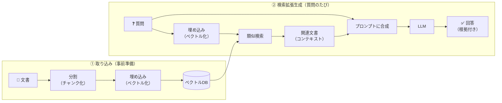
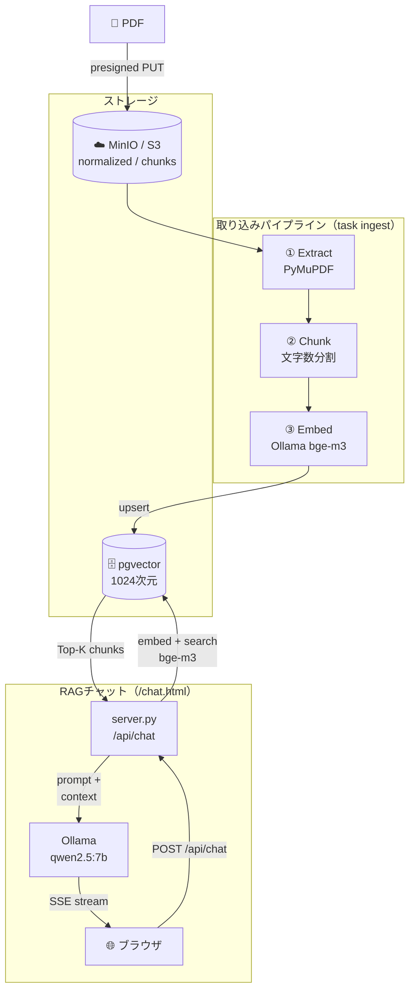

## はじめに

「RAG」という言葉はもう珍しくありません。ただ、「検索結果をプロンプトに足すだけ」という説明は正しい一方でざっくりしすぎていて、実際に自分で作ろうとすると「何を・どう・どこまで」検索して渡すのかで迷います。

この記事は、そのギャップを自作の日本語の書籍検索AI [biblio-rag](https://github.com/Kaaaaazuya/biblio-rag) の実物パイプラインで埋める入門ハブ記事です。RAGの一般的な仕組みを整理したあと、biblio-ragが実際にどう作られているかを対応させて図解します。

**この記事で分かること**

- なぜ素のLLMだけでは「知らないこと」に答えられないのか
- RAG（Retrieval-Augmented Generation / 検索拡張生成）が何を・どの順で行っているか
- biblio-ragの実物パイプライン（Extract → Chunk → Embed → 検索 → 生成）の全体像

**対象読者**: RAGという言葉は聞いたことがあるが、実際の処理の流れをイメージできていない人

## 題材アプリ

[biblio-rag](https://github.com/Kaaaaazuya/biblio-rag) — 購入済みの日本語PDF書籍を入力に、検索対象となるベクトルインデックスを構築する取り込みパイプラインと、そこに対して質問できるRAGチャットUIです。

本記事の内容は[コミット `675f3f0` 時点](https://github.com/Kaaaaazuya/biblio-rag/tree/675f3f0accc33aee5bba1072ff624fef5b14b93e)のREADME・設計に基づきます。詳細な実装解説は各論記事（後述）に譲り、この記事ではコードの深追いはしません。

## 課題: なぜ素のLLMでは足りないのか

LLMは学習時点までの一般知識は持っていますが、次の3つには対応できません。

- **手元にしかないデータ**: 自分が買った書籍の内容など、そもそも学習データに含まれていない情報
- **鮮度**: 学習後に更新された情報
- **根拠の提示**: 「知っているっぽいこと」を自信満々に答えてしまう幻覚（hallucination）と、その真偽を検証する手段のなさ

これを解決する素朴な方法の1つがファインチューニング（追加学習でモデル自体を書き換える）です。ただし書籍が増えるたびに再学習するのはコストと時間がかかり、個人開発では現実的ではありません。RAGは「モデルは変えず、質問に関連しそうな文書を検索してプロンプトに埋め込む」ことで、この問題を実行時に解決するアプローチです。

## 全体像: RAGの一般的な流れ

RAGは大きく2つのフェーズに分かれます。事前に文書を検索できる形にしておく**取り込み（インデックス作成）**と、質問のたびに検索して答えを作る**検索拡張生成**です。

ポイントは、質問文と文書の両方を**同じ埋め込みモデルで同じベクトル空間に変換する**ことです。そうして初めて「意味の近さ」を距離として比較できるようになり、キーワードが一致しなくても意味的に関連する文書を見つけられます。

## biblio-ragでの対応関係

上の一般的な流れに対して、biblio-ragは次のように実装されています（README添付のアーキテクチャ図そのまま）。

一般的なRAGの各ステップと、biblio-ragでの実装を対応させると次のようになります。

| 一般的なRAGのステップ    | biblio-ragでの実装                                                          |
| ------------------------ | --------------------------------------------------------------------------- |
| 文書の分割（チャンク化） | PyMuPDFでPDFを抽出後、文字数ベースで分割（`workers/chunk/`）                |
| 文書の埋め込み           | Ollama `bge-m3`（1024次元）で埋め込み、pgvectorへupsert（`workers/embed/`） |
| ベクトルDB               | pgvector（開発・本番共通スキーマ）                                          |
| 質問の埋め込み＋類似検索 | `server.py` の `/api/chat` が同じ `bge-m3` で埋め込み、pgvectorをTop-K検索  |
| プロンプトへの合成       | 検索結果のチャンクをコンテキストとして整形し、システムプロンプトへ組み込み  |
| 生成                     | Ollama `qwen2.5:7b` でSSEストリーミング生成、ブラウザへ逐次表示             |

「取り込み」と「検索拡張生成」が別のライフサイクルで動く、という点が実物を見ると分かりやすくなります。PDFのアップロードは書籍を追加したときだけ発生し、チャットは質問のたびに独立して走ります。開発環境ではOllama＋Docker pgvectorだけで完結します。本番はAWS（Fargate + Lambda + SQS + Bedrock）＋Neon（サーバレスpgvector）に置き換わりますが、この「取り込み→検索→生成」という骨格自体は変わりません。

## 設計判断とトレードオフ

| 案                      | 採否 | 理由                                                                       |
| ----------------------- | ---- | -------------------------------------------------------------------------- |
| RAG（検索で根拠を渡す） | ✅   | 書籍が増えるたびの再学習が不要。検索元を差し替えるだけで最新化できる       |
| ファインチューニング    | ❌   | 書籍追加のたびに再学習が必要でコストが見合わない。個人開発の運用に乗らない |
| 素のLLM（検索なし）     | ❌   | 学習データにない書籍の内容には答えられず、幻覚のリスクも高い               |

RAGにも弱点はあります。チャンクの切り方や検索精度が悪いと「近いが答えでない」文書を渡してしまい、逆に回答の質を下げることがあります。この改善（Rerank・Hybrid検索・HyDEなど）は各論記事で扱います。

「モデルを賢くする」のではなく「モデルに渡す材料をアプリコード側で選ぶ」という発想は、[エージェント編第1回](/blog/ai-arch-01-llm-responsibility/)で扱った「LLMに決めさせる範囲を最小化する」設計思想とも重なります。

## まとめ

RAGは「モデルを変えずに、検索で根拠となる文書を渡す」ことで、手元のデータ・鮮度・根拠提示という素のLLMの弱点を補う仕組みです。biblio-ragでは、PDFを抽出・分割・埋め込みして事前にpgvectorへ格納しておき、質問のたびに同じ埋め込みモデルで類似検索し、結果をプロンプトに合成してLLMに生成させています。

次回以降は、この骨格を実コードで深掘りする各論記事を出していきます。テーマは、取り込みパイプラインの全体設計、チャンク分割に「AIを使わない」判断、開発／本番の実装差し替え、検索精度の改善手法、検索評価基盤、SSEストリーミングチャット、ベクトルデータの整合性です。公開ができ次第、この記事からもリンクを追記していきます。

## 参考

- [biblio-rag リポジトリ](https://github.com/Kaaaaazuya/biblio-rag)（本記事はコミット `675f3f0` 時点のREADME・設計に基づく）
- [biblio-rag docs/design.md](https://github.com/Kaaaaazuya/biblio-rag/blob/675f3f0accc33aee5bba1072ff624fef5b14b93e/docs/design.md)
- [biblio-rag docs/adr/](https://github.com/Kaaaaazuya/biblio-rag/tree/675f3f0accc33aee5bba1072ff624fef5b14b93e/docs/adr)
